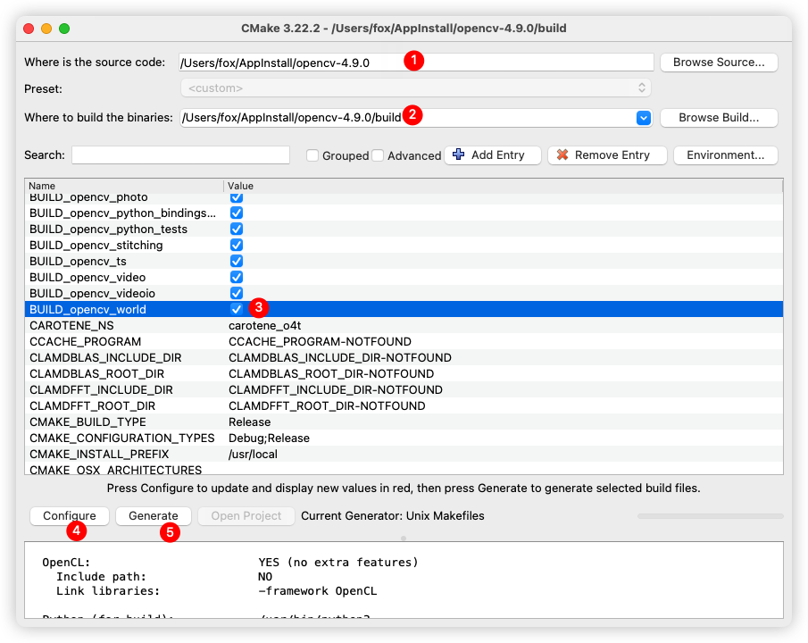
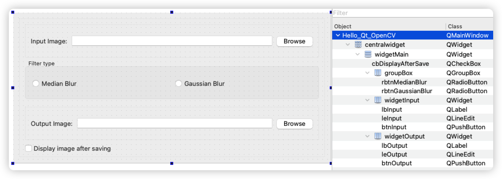

<div align="center">
<p>
 
 <p align="center"><b><font size=6>OpenCV</font></b></p>
 <p align="center"><b>基于 Qt 和 C++ 的计算机视觉示例实现</b></p>
</p>


[](LICENSE)


<div align="left">
<!-- 顶部至此截止 -->
<!-- SPbSTU 报告起始 -->

[toc]


# 前言

> 参考：
>
> 原文：[Computer Vision with OpenCV 3 and Qt5](https://1lib.org/book/3427589/3c1476)
>
> https://github.com/apachecn/apachecn-cv-zh/blob/0f2e14ca582d398ba3be22a1fff949077f4c85c0/docs/cv-opencv3-qt5
>
> 
>
> 原文：[Qt 5 and OpenCV 4 Computer Vision Projects](https://1lib.org/book/5220725/d23493)
>
> https://github.com/apachecn/apachecn-cv-zh/tree/0f2e14ca582d398ba3be22a1fff949077f4c85c0/docs/qt5-opencv4-cv-proj

只要环顾四周，就很可能会看到至少两个不同的设备，例如计算机，智能手机，智能手表或平板电脑，上面运行着一些应用，可以帮助您完成各种日常任务或娱乐音乐，看电影 ，视频游戏等。 每年，市场上都会引入数百种新设备，并且需要新版本的操作系统来跟上它们，以便为应用开发人员提供更好的界面，以创建可更好地利用诸如高分辨率等基础资源的软件。 显示器，各种传感器等。 结果，软件开发框架必须适应并支持不断增长的平台。 考虑到这一点，Qt 可能是同时提供功能，速度，灵活性和易用性的最成功的**跨平台**软件开发框架之一，在创建需要以下功能的软件时，它是首选。 在各种平台上都具有吸引力和一致性。

近年来，特别是随着功能更强大的处理器以较低的价格出现，台式计算机及其手持式对等设备的角色已转向执行更苛刻和更复杂的任务，例如计算机视觉。 无论是用于智能电影或照片编辑，保护敏感建筑物，对生产线中的物体计数，还是通过自动驾驶汽车检测交通标志，车道或行人，计算机视觉正越来越多地用于解决此类实时问题。 曾经只能由人类解决的问题。 这是 OpenCV 框架进入现场的地方。 在过去的几年中，OpenCV 已成长为功能完善的跨平台计算机视觉框架，其重点是速度和性能。 在世界各地，开发人员和研究人员都在使用 OpenCV 来实现其计算机视觉应用的思想和算法。

本书旨在帮助您掌握 Qt 和 OpenCV 框架的基本概念，使您轻松地自己继续开发和交付跨多种平台的计算机视觉应用。 能够轻松遵循本书所涵盖主题的唯一假设是，您熟悉并熟悉 C++ 编程概念，例如类，模板，继承等。 即使整本书中涵盖的教程，屏幕截图和示例都是基于 Windows 操作系统的，但仍会在必要时提及 MacOS 和 Linux 操作系统的区别。


**这本书是给谁的**

本书面向有兴趣构建计算机视觉应用的读者。 期望具备 C++ 编程的中级知识。 即使没有 Qt5 和 OpenCV 3 知识，但如果您熟悉这些框架，您也会受益


**本书涵盖的内容**

- **第1章，OpenCV和Qt简介**
介绍了所有必要的初始化步骤。从在哪里以及如何获取Qt和OpenCV框架开始，本章将描述如何安装、配置，以及确保你的开发环境设置正确。

- **第2章，创建我们的第一个Qt和OpenCV项目**
带领你通过Qt Creator IDE，我们将使用它开发我们所有的应用程序。在本章中，你将学习如何创建和运行你的应用程序项目。

- **第3章，创建一个全面的Qt+OpenCV项目**
通过最常见的功能需求，为一个全面的应用程序，包括样式、国际化、支持各种语言、插件等。通过这个过程，我们将自己创建一个全面的计算机视觉应用程序。

- **第4章，Mat和QImage**
奠定基础并教你编写计算机视觉应用程序所需的基本概念。在这一章中，你将了解所有关于OpenCV Mat类和Qt QImage类，如何在两个框架之间转换和传递它们，以及更多。

- **第5章，图形视图框架**
教你如何使用Qt Graphics View框架及其底层类，以便在应用程序中轻松高效地显示和操作图形。

- **第6章，OpenCV中的图像处理**
带你了解OpenCV框架提供的图像处理功能。你将学习关于变换、过滤器、颜色空间、模板匹配等。

- **第7章，特征和描述符**
全面讲解从图像中检测关键点，从关键点提取描述符，并将它们相互匹配。在本章中，你将学习各种关键点和描述符提取算法，并使用它们来检测和定位图像中的已知对象。

- **第8章，多线程**
教你Qt框架提供的所有关于多线程的能力。你将学习关于互斥锁、读写锁、信号量和各种线程同步工具。这章还会教你关于Qt中低级（QThread）和高级（QtConcurrent）多线程技术。

- **第9章，视频分析**
覆盖了使用Qt和OpenCV框架正确处理视频的方法。你将学习使用MeanShift和CAMShift算法进行对象跟踪等视频处理功能。本章还包括视频处理的所有基本和必要概念的综合概述，如直方图和反向投影图像。

- **第10章，调试和测试**
带你了解Qt Creator IDE的调试功能，以及它是如何配置和设置的。在本章中，你还将学习Qt框架提供的单元测试能力，通过编写示例单元测试，这些测试可以手动或每次项目构建时自动运行。

- **第11章，链接和部署**
教你动态或静态地构建OpenCV和Qt框架。在这一章中，你还将学习在各种平台上部署Qt和OpenCV应用程序。在本章的最后，我们将使用Qt Installer Framework创建一个安装程序。

- **第12章，Qt Quick应用程序**
介绍你Qt Quick应用程序和QML语言。在本章中，你将学习QML语言语法，以及如何与Qt Quick Designer一起使用它来为桌面和移动平台创建漂亮的Qt Quick应用程序。你还将学习在本章中整合QML和C++。


**为了充分利用本书**

尽管书的初章已经涵盖了每一个所需的工具和软件、正确的版本，以及它们是如何被安装和配置的，以下是一个可以作为快速参考的列表：

- 一台安装了最新版本Windows、macOS或Linux（例如Ubuntu）操作系统的常规计算机。
- 微软Visual Studio（在Windows上）
- Xcode（在macOS上）
- CMake
- Qt框架
- OpenCV框架


**下载示例代码文件**

你可以从你在www.packtpub.com的账户下载本书的示例代码文件。如果你是在别处购买的这本书，你可以访问www.packtpub.com/support并注册，以直接将文件通过电子邮件发送给你。
你可以按照以下步骤下载代码文件：

1. 在www.packtpub.com登录或注册。
2. 选择SUPPORT标签。
3. 点击Code Downloads & Errata。
4. 在搜索框中输入书名并按照屏幕上的指示操作。

一旦文件下载完成，请确保你使用最新版本的以下软件解压或提取文件夹：

- 对于Windows，使用WinRAR/7-Zip
- 对于Mac，使用Zipeg/iZip/UnRarX
- 对于Linux，使用7-Zip/PeaZip

本书的代码包也托管在GitHub上 https://github.com/PacktPublishing/Computer-Vision-with-OpenCV-3-and-Qt5。我们也在https://github.com/PacktPublishing/ 上提供了我们丰富的图书和视频目录中的其他代码包。去看看吧！


**下载彩色图片**

我们还提供了一个PDF文件，其中包含了本书使用的截图/图表的彩色图片。你可以在这里下载它：[https://www.packtpub.com/sites/default/files/downloads/ComputerVisionwithOpenCV3andQt5_ColorImages.pdf](https://www.packtpub.com/sites/default/files/downloads/ComputerVisionwithOpenCV3andQt5_ColorImages.pdf)


**使用的约定**

本书中使用了多种文本约定。

- `CodeInText`：表示文中的代码词汇、数据库表名、文件夹名称、文件名、文件扩展名、路径名、虚构的URL、用户输入和Twitter句柄。这里有一个例子："`QApplication`类是负责控制应用程序的控制流、设置等的主类。"

- 代码块如下所示：
    ```cpp
    #include "mainwindow.h"
    #include <QApplication>
    int main(int argc, char *argv[])
    {
        QApplication a(argc, argv);
        MainWindow w;
        w.show();
        return a.exec();
    }
    ```

- 当我们希望把你的注意力吸引到代码块的特定部分时，相关的行或项将以**加粗**形式展示：
    ```cpp
    #include "mainwindow.h"
    #include <QApplication>
    int main(int argc, char *argv[])
    {
        QApplication a(argc, argv);
        MainWindow w;
        **w.show();**
        return a.exec();
    }
    ```

- 任何命令行输入或输出如下所写：
    ```
    binarycreator -p packages -c config.xml myinstaller
    ```

- **加粗**：表示一个新术语、一个重要词汇或你在屏幕上看到的词汇。例如，菜单或对话框中的词汇在文本中如此显示。这里有一个例子："点击`Next`按钮将你移动到下一个屏幕。"


# 第一章、OpenCV 和 Qt 简介

在其最基本的形式和结构中，计算机视觉是一个术语，用来识别所有用于赋予数字设备视觉感知能力的方法和算法。这意味着什么？嗯，这确实意味着它听起来的样子。理想情况下，计算机应该能够通过标准摄像机的镜头（或任何其他类型的摄像机）看到世界，并通过应用各种计算机视觉算法，它们应该能够检测到人脸，甚至识别它们，在图像中计数物体，检测视频流中的运动等等，这些起初可能只被期望人类能够做到。因此，要了解计算机视觉真正是什么，最好了解计算机视觉旨在开发实现所提到的理想的方法，赋予数字设备看到和理解周围环境的能力。值得注意的是，大多数情况下，计算机视觉和图像处理是可以互换使用的（尽管，对该主题的历史研究可能证明应该有所不同）。但无论如何，在本书中，我们将坚持使用计算机视觉这个术语，因为这是当今计算机科学社区中更受欢迎和广泛使用的术语，而且正如我们将在本章后面看到的那样，**图像处理是 OpenCV 库的一个模块**，我们将在本章的接下来的页面中介绍它，并且它也将在一个完整的章节中进行详细介绍。

计算机视觉是当今计算机科学中最受欢迎的主题之一，它被应用于各种应用程序中，从检测癌组织的医疗工具到帮助制作所有那些闪亮音乐视频和电影的视频编辑软件，再到军用级别的目标检测器，帮助在地图上找到特定位置，以及帮助无人驾驶汽车找到路线的交通标志检测器。嗯，很明显我们无法列出计算机视觉的所有可能性，但我们可以肯定它是一个有趣的主题，将在很长一段时间内存在。还值得一提的是，计算机视觉领域的工作和职业市场正在迅速扩展，而且正在日益增长。

在计算机视觉开发人员和专家中最受欢迎的工具中，有两个最突出的开源框架，它们也是您手头书籍的标题中的两个框架，即 OpenCV 和 Qt。每天，全世界成千上万的开发人员，从成熟的公司到创新的初创公司，都在使用这两个框架来为各种行业构建应用程序，比如我们提到的那些行业，而这正是您将在本书中学到的内容。

在本章中，我们将涵盖以下主题：

- 介绍 Qt，一个开源的跨平台应用程序开发框架
- 介绍 OpenCV，一个开源的跨平台计算机视觉框架
- 【省略】如何在 Windows、macOS 和 Linux 操作系统上安装 Qt
- 如何从源代码构建 OpenCV 在 Windows、macOS 和 Linux 操作系统上
- 配置您的开发环境以构建使用 Qt 和 OpenCV 框架的应用程序
- 使用 Qt 和 OpenCV 构建您的第一个应用程序


**需要什么：**

这是在本章介绍中提到的最明显的问题，但对它的回答也是我们学习计算机视觉的第一步。本书面向熟悉 C++ 编程语言并希望在不费力气的情况下开发强大且外观优美的计算机视觉应用程序的开发人员。本书旨在通过不同的计算机视觉主题带领您进行一场充满乐趣的旅程，重点放在实践练习和逐步开发您所学内容上。

任何有足够 C++ 经验的人都知道，使用原始的 C++ 代码并依赖于特定于操作系统的 API 来编写视觉丰富的应用程序并不是一件容易的任务。因此，几乎每个 C++ 开发人员（或至少是在 C++ 领域有积极职业生涯的严肃开发人员）都会使用一个或多个框架来简化这个过程。在为 C++ 开发的最广泛知名的框架中，Qt 是其中之一。事实上，如果不是最佳选择，那么它肯定是*其中之一*的最佳选择。另一方面，如果您的目标是开发处理图像或可视化数据集的应用程序，那么 OpenCV 框架可能是您首选的第一个（也许是最受欢迎的）地址。因此，这就是本书专注于 Qt 和 OpenCV 结合使用的原因。开发适用于不同桌面和移动平台的计算机视觉应用程序，以最高可能的性能运行，这是不可能的，而不使用像 Qt 和 OpenCV 这样的强大框架的组合。

总结所说的，确保您至少具有 C++ 编程语言的中级水平知识。如果诸如类、抽象类、继承、模板或指针等术语对您来说听起来很陌生，那么考虑先阅读一本关于 C++ 的书籍。对于所有其他涉及的主题，特别是所有涉及的实践主题，本书承诺为所有包含的示例和教程提供清晰明了的解释（或指向特定文档页面的引用）。当然，要详细深入地了解 Qt 和 OpenCV 中的模块和类是如何实现的，您需要熟悉更多的资源、研究，有时甚至是硬核的数学计算或对计算机或操作系统在现实世界中执行的低级理解，这完全超出了本书的范围。然而，对于本书涵盖的所有算法和方法，您将得到它们是什么，如何以及何时何地使用它们的简要描述，以及足够的指导，让您如果愿意的话可以继续深入挖掘。


## Qt 简介

你可能已经听说过它，甚至在不知情的情况下使用过它。它是许多世界著名的商业和开源应用程序的基础，例如 VLC 播放器、Calibre 等等。Qt 框架被所谓的财富 500 强公司的大多数公司使用，我们甚至无法开始定义它在世界上许多应用程序开发团队和公司中的广泛使用和受欢迎程度。因此，我们将从介绍开始，然后逐步深入。

首先，让我们通过对 Qt 框架的简要介绍来使我们站稳脚跟。没有什么比在脑海中清晰地描绘整个框架更能让您感到舒适的了。所以，我们开始吧，目前由 The Qt Company 构建和管理，Qt 框架是一个开源应用程序开发框架，被广泛用于创建视觉丰富且跨平台的应用程序，这些应用程序可以在不同的操作系统或设备上非常轻松地运行，甚至几乎不需要任何努力。进一步分解，开源是其中最明显的部分。这意味着您可以访问 Qt 的所有源代码。所谓的视觉丰富，是指 Qt 框架中具有足够的资源和功能，可以编写非常漂亮的应用程序。至于最后一部分，跨平台，这基本上意味着，如果您使用 Qt 框架模块和类为 Microsoft Windows 操作系统开发应用程序，那么它可以像原样编译和构建为 macOS 或 Linux，而无需更改一行代码（几乎），前提是您的应用程序不使用任何非 Qt 或特定于平台的库。

在编写本书时，Qt 框架（从现在起简称为 Qt）的版本是 5.9.X，它包含许多模块，几乎可以用于开发应用程序的任何目的。**Qt 将这些模块划分为以下四个主要类别：**

- **Qt Essentials**
- **Qt Add-Ons**
- **Value-Add Modules**
- **Technology Preview Modules**

让我们看看它们是什么以及它们包含了什么，因为我们将在本书中经常处理它们。

### Qt Essentials

这些是 **Qt 所承诺在所有支持的平台上可用的模块**。它们基本上是 **Qt 的基础**，包含了几乎所有 Qt 应用程序使用的大多数类。要真正关注 *通用* 这两个词，因为这正是这些模块的用途。以下是现有模块的快速研究和以后参考的简要列表：

| 模块                                                         | 描述                                                         |
| ------------------------------------------------------------ | ------------------------------------------------------------ |
| [Qt Core](http://doc.qt.io/qt-5/qtcore-index.html)           | 这些是其他模块使用的核心非图形类。                           |
| [Qt GUI](http://doc.qt.io/qt-5/qtgui-index.html)             | 这些是用于图形用户界面 (GUI) 组件的基本类。包括 OpenGL。     |
| [Qt Multimedia](http://doc.qt.io/qt-5/qtmultimedia-index.html) | 这些是用于音频、视频、收音机和摄像头功能的类。               |
| [Qt Multimedia Widgets](http://doc.qt.io/qt-5/qtmultimediawidgets-index.html) | 这些是基于窗口小部件的类，用于实现多媒体功能。               |
| [Qt Network](http://doc.qt.io/qt-5/qtnetwork-index.html)     | 这些是使网络编程更轻松和更可移植的类。                       |
| [Qt QML](http://doc.qt.io/qt-5/qtqml-index.html)             | 这些是用于 QML 和 JavaScript 语言的类。                      |
| [Qt Quick](http://doc.qt.io/qt-5/qtquick-index.html)         | 这是一个声明性框架，用于构建具有自定义用户界面的高度动态的应用程序。 |
| [Qt Quick Controls](http://doc.qt.io/qt-5/qtquickcontrols-index.html) | 这些是基于 Qt Quick 的可重用 UI 控件，用于创建经典的桌面风格用户界面。 |
| [Qt Quick Dialogs](http://doc.qt.io/qt-5/qtquickdialogs-index.html) | 这些是用于从 Qt Quick 应用程序创建和与系统对话框交互的类型。 |
| [Qt Quick Layouts](http://doc.qt.io/qt-5/qtquicklayouts-index.html) | 这些布局是用于在用户界面中排列基于 Qt Quick 2 的项目的项目。 |
| [Qt SQL](http://doc.qt.io/qt-5/qtsql-index.html)             | 这些是用于使用 SQL 进行数据库集成的类。                      |
| [Qt Test](http://doc.qt.io/qt-5/qttest-index.html)           | 这些是用于对 Qt 应用程序和库进行单元测试的类。               |
| [Qt Widgets](http://doc.qt.io/qt-5/qtwidgets-index.html)     | 这些是用于扩展 Qt GUI 的 C++ 窗口小部件类。                  |

要获取更多信息，请参阅 http://doc.qt.io/qt-5/qtmodules.html。

请注意，涵盖本书中的所有模块和所有类可能是不可能的，也许也不是一个好主意。在大多数情况下，我们将坚持使用我们需要的模块和类

### Qt 附加模块

这些模块可能在所有平台上可用，也可能不可用。这意味着它们用于开发特定功能，而不是 Qt Essentials 的通用性质。这些类型模块的一些示例包括 Qt 3D、Qt 打印支持、Qt WebEngine、Qt 蓝牙等等。您始终可以参考 Qt 文档以获取这些模块的完整列表，实际上，它们太多了，无法在此列出。大多数情况下，您只需简单浏览一下，就可以对模块的用途有一个简要的了解。

要获取更多信息，您可以参考 http://doc.qt.io/qt-5/qtmodules.html。

### 价值增值模块

这些模块提供额外的功能，并通过 Qt 提供商提供商业许可证。是的，你猜对了，这些模块只在 Qt 的付费版本中可用，并且不在 Qt 的开源和免费版本中提供，但它们大多数旨在帮助完成本书目的中根本不需要的非常具体的任务。您可以使用 Qt 文档页面获取列表。

要获取更多信息，您可以参考 http://doc.qt.io/qt-5/qtmodules.html。

### 技术预览模块

正如其名称所示，这些模块通常以不保证对所有情况都有效的状态提供；它们可能包含错误或其他问题，而且它们仍在开发中，作为测试和反馈目的的预览提供。一旦模块开发并足够成熟，它就会在前面提到的其他类别中提供，并从技术预览类别中移除。在撰写本书时，这些类型的模块的一个示例是 Qt Speech，它是一个旨在为 Qt 应用程序添加文本到语音支持的模块。如果您希望成为一名完全合格的 Qt 开发人员，随时关注这些模块总是一个好主意。

要获取更多信息，您可以参考 http://doc.qt.io/qt-5/qtmodules.html。

### Qt 支持的平台

当我们谈论开发应用程序时，平台可能有许多不同的含义，包括操作系统类型、操作系统版本、编译器类型、编译器版本和处理器架构（32 位、64 位、Arm 等）。Qt 支持许多（如果不是全部）著名的平台，并且通常在发布新平台时能够迅速跟上。以下是在撰写本书时（Qt 5.9）由 Qt 支持的平台列表。请注意，您可能不会使用这里提到的所有平台，但它让您了解 Qt 真正的强大和跨平台性质：

参考：http://doc.qt.io/qt-5/supported-platforms.html

正如您将在接下来的章节中看到的那样，我们将在 Windows 上使用 Microsoft Visual C++ 2015（或从这里简称为 MSVC 2015）编译器，因为 Qt 和 OpenCV（您将在后面学习到）都高度支持它。我们还将在 Linux 上使用 GCC，在 macOS 操作系统上使用 Clang。所有这些工具要么是免费且开源的，要么是由操作系统提供者提供的。尽管我们的主要开发系统将是 Windows，但在 Windows 和其他版本之间存在差异时，我们将涵盖 Linux 和 macOS 操作系统。因此，本书中的默认截图将是 Windows 的截图，而在 Windows 和其他版本之间存在明显差异而不仅仅是路径、按钮颜色等方面的细微差别时，我们将提供 Linux 和 macOS 的截图。

## Qt Creator

Qt Creator 是用于开发 Qt 应用程序的 **IDE** (**集成开发环境**) 的名称。它也是我们在本书中将用来创建和构建项目的 IDE。值得注意的是，Qt 应用程序可以使用任何其他 IDE（例如 Visual Studio 或 Xcode）来创建，并且 **Qt Creator 不是构建 Qt 应用程序的必需品，但它是一个轻量级且功能强大的 IDE**，默认情况下随 Qt Framework 安装程序一起提供。因此，它最大的优势在于与 Qt 框架的轻松集成。

以下是 Qt Creator 的截图，显示了 IDE 的代码编辑模式。关于如何使用 Qt Creator 的详细信息将在下一章中介绍，尽管我们将在本章稍后的一些测试中尝试使用它，但不会过多地详细介绍它：


## OpenCV 简介

现在，是时候介绍 OpenCV，即**开源计算机视觉库**，或者如果您愿意的话，也可以称之为**框架**，因为 OpenCV 本身会互换使用它们，在本书中也可能会发生这种情况。但是，在大多数情况下，我们将简单地坚持使用 OpenCV。好的，让我们先听听它到底是什么，然后在需要的地方进行详细说明。

OpenCV 是一个**开源跨平台库**，用于开发计算机视觉应用程序。它**专注于速度和性能**，并包含了许多算法在各种模块中。这些模块也分为两种类型：主要模块和额外模块。主要的 OpenCV 模块简单地是指 OpenCV 社区内建立和维护的所有模块，它们是 OpenCV 提供的默认包的一部分。

这与 OpenCV 的额外模块形成对比，后者多多少少是第三方库的包装器和接口，用于将它们集成到 OpenCV 构建中。以下是一些不同模块类型的示例，并附有简要说明。值得注意的是，随着时间的推移，OpenCV 中的模块数量（有时甚至顺序）可能会发生变化，因此要牢记的关于这一点的最佳方法就是只需访问 OpenCV 文档页面，每当有些事情似乎不合时宜时，或者如果某些东西不在原来的位置时。

### 主要模块

以下是一些 OpenCV 主要模块的示例。请注意，它们只是 OpenCV 中的一小部分（可能是最常用的部分），覆盖所有模块超出了本书的范围，但了解 OpenCV 包含的内容是有意义的，就像本章前面看到的 Qt 一样。这里它们是：

- **核心功能或简称为`core`模块**包含所有其他 OpenCV 模块使用的所有基本结构，常量和函数。 例如，在此模块中定义 OpenCV `Mat`类，在本书的其余部分中，我们几乎将在每个 OpenCV 示例中使用该类。 第 4 章，“`Mat`和`QImage`”将涵盖这个模块以及与之密切相关的 OpenCV 模块以及 Qt 框架的相应部分。
- **图像处理或`imgproc`模块**包含许多用于图像过滤，图像转换的算法，顾名思义，它用于**一般图像处理**。 我们将在第 6 章，“OpenCV 中的图像处理”中介绍此模块及其功能。
- **2D 特征框架模块或`features2d`包含用于特征提取和匹配的类和方法**。 它们将在第 7 章，“特征和描述符”中进行详细介绍。
- **视频模块**包含用于主题的算法，例如运动估计，背景减法和跟踪。 该模块以及 OpenCV 的其他类似模块，将在第 9 章，“视频分析”中介绍。

### 额外模块

正如之前提到的，**额外模块**主要是第三方库的包装器，这意味着它们只包含用于集成这些模块的接口或方法。一个例子是文本模块。该模块包含用于在图像中使用文本检测或 **OCR** (**光学字符识别**) 的接口，您还将需要这些第三方模块，它们不作为本书的一部分进行涵盖，但您可以随时查看 OpenCV 文档以获取更新的额外模块列表以及它们的使用方法。

有关更多信息，请参阅 http://docs.opencv.org/master/index.html。

**OpenCV 支持的平台**：如前所述，在应用程序开发中，平台不仅仅是操作系统。因此，我们需要知道 OpenCV 支持哪些操作系统、处理器架构和编译器。OpenCV 是高度跨平台的，几乎与 Qt 类似，您可以为所有主要操作系统（包括 Windows、Linux、macOS、Android 和 iOS）开发 OpenCV 应用程序。稍后我们将看到，我们将在 Windows 上使用 MSVC 2015 (32 位) 编译器，在 Linux 上使用 GCC，在 macOS 上使用 Clang。还要注意，我们将需要自己使用其源代码构建 OpenCV，因为目前并没有为上述编译器提供预构建的二进制文件。然而，稍后您将看到，如果您有正确的工具和说明，OpenCV 对于任何操作系统都相当容易构建。

## 安装 OpenCV

在本章的这一部分，您将学习如何使用其源代码构建 OpenCV。正如您稍后将看到的，并与本节的标题相反，我们并没有像在Qt安装中那样真正“安装”OpenCV。这是因为 **OpenCV 通常不提供针对所有编译器和平台的预构建二进制文件**，事实上，它根本不为 macOS 和 Linux 提供预构建二进制文件。在最新的 OpenCV Win 包中，只包含了针对 MSVC 2015 64 位的预构建二进制文件，这与我们将要使用的 32 位版本不兼容，因此学习如何自己构建 OpenCV 是一个非常好的主意。这也有利于构建适合您需求的 OpenCV 框架库。您可能希望排除一些选项以使您的 OpenCV 安装更轻量化，或者您可能希望为其他编译器（如 MSVC 2013）构建。因此，有很多理由自己从源代码构建 OpenCV。

### 准备构建 OpenCV

互联网上大多数开源框架和库，或者至少那些希望保持 IDE 中立的项目（这意味着可以使用任何 IDE 配置和构建的项目，不依赖于特定 IDE 即可工作的项目），使用 CMake 或类似的所谓“构建”系统。我想这也回答了诸如“我为什么需要 CMake？”、“他们为什么不直接给出库并完成呢？”或类似这样的问题。因此，我们需要 CMake 能够使用源代码配置和构建 OpenCV。CMake 是一个开源的跨平台应用程序，允许配置和构建开源项目（或应用程序、库等），您可以在之前的章节中提到的所有操作系统上下载和使用它。在撰写本书的时候，CMake 版本 3.9.1 可以从 CMake 网站下载页面 ([https://cmake.org/download/](https://cmake.org/download/)) 下载。

在继续之前，请确保在计算机上下载并安装它。CMake 安装没有特别需要注意的地方，除了您应该确保安装 GUI 版本，因为这是我们将在下一节中使用的版本，也是提供的链接中的默认选项。

### 获取 OpenCV？

OpenCV 在其网站的 Releases 页面维护其官方和稳定的发布版本 ([http://opencv.org/releases.html](http://opencv.org/releases.html))：


在这里，您始终可以找到适用于 Windows，Android 和 iOS 的最新版本的 OpenCV 源代码，文档和预构建的二进制文件。 随着新版本的发布，它们会添加到页面顶部。 在撰写本书时，版本 3.3.0 是 OpenCV 的最新版本，这就是我们将使用的版本。 因此，事不宜迟，您应该继续进行操作，并通过单击 3.3.0 版的“源”链接来下载源。 将`source zip`文件下载到您选择的文件夹中，将其提取出来，并记下提取的路径，因为稍后我们将使用它。

### 如何构建？

现在，我们拥有构建 OpenCV 所需的所有工具和文件，我们可以通过运行 CMake GUI 应用来启动该过程。 如果正确安装了 CMake，则应该能够从桌面，开始菜单或扩展坞运行它，具体取决于您的操作系统。

Linux 用户应在终端中运行以下命令，然后再继续进行 OpenCV 构建。 这些基本上是 OpenCV 本身的依赖关系，需要在配置和构建它之前就位：

```cpp
sudp apt-get install libgtk2.0-dev and pkg-config 
```

**运行 CMake GUI 应用后，需要设置以下两个文件夹：**

*   “源代码在哪里”文件夹应设置为您下载和提取 OpenCV 源代码的位置
*   可以将“生成二进制文件的位置”文件夹设置为任何文件夹，但是通常在源代码文件夹下创建一个名为`build`的子文件夹并将其选择为二进制文件文件夹

设置这两个文件夹后，您可以通过单击“配置”按钮继续前进，如以下屏幕截图所示：



单击配置按钮将启动配置过程。 如果构建文件夹尚不存在，可能会要求您创建该文件夹，您需要通过单击“是”按钮来对其进行回答。 如果您仍然觉得自己只是在重复书中的内容，请不要担心。 当您继续阅读本书和说明时，所有这些都会陷入。 现在，让我们仅关注在计算机上构建和安装 OpenCV。 考虑到此安装过程并不像单击几个“下一步”按钮那样简单，并且一旦开始使用 OpenCV，一切都会变得有意义。 因此，在接下来出现的窗口中，选择正确的生成器，然后单击“完成”。 

---

有关每个操作系统上正确的生成器类型，请参阅以下说明：

**Windows 用户**：您需要选择`Visual Studio 142015`。请确保您未选择 ARM 或 Win64 版本或其他 Visual Studio 版本。

---

**MacOS 和 Linux 用户**：您需要选择`Unix Makefile`。

您将在 CMake 中看到一个简短的过程，完成后，您将能够设置各种参数来配置您的 OpenCV 构建。 有许多参数需要配置，因此我们将直接影响那些直接影响我们的参数。

**确保选中`BUILD_opencv_world`选项旁边的复选框。 这将允许将所有 OpenCV 模块构建到单个库中。** 因此，如果您使用的是 Windows，则只有一个包含所有 OpenCV 功能的 DLL 文件。 正如您将在后面看到的那样，当您要部署计算机视觉应用时，这样做的好处是仅使用一个 DLL 文件即可。 当然，这样做的明显缺点是您的应用安装程序的大小会稍大一些。 但是同样，易于部署将在以后证明更加有用。

更改构建参数后，您需要再次单击“配置”按钮。 等待重新配置完成，最后单击“生成”按钮。 这将使您的 OpenCV 内部版本可以编译。 


在下一部分中，如果使用 Windows，MacOS 或 Linux 操作系统，则需要执行一些不同的命令。 因此，它们是：

---

**Windows 用户**：转到您先前在 CMake 中设置的 OpenCV 构建文件夹（在我们的示例中为`c:\dev\opencv\build`）。 应该有一个 Visual Studio 2015 解决方案（即 MSVC 项目的类型），您可以轻松地执行和构建 OpenCV。 您也可以立即单击 CMake 上“生成”按钮旁边的“打开项目”按钮。 您也可以只运行 Visual Studio 2015 并打开您刚为 OpenCV 创建的解决方案文件。

打开 Visual Studio 之后，需要从 Visual Studio 主菜单中选择“批量生成”。 就在`Build`下：


确保在`Build`列中为`ALL_BUILD`和`INSTALL`启用了复选框，如以下屏幕截图所示：


---

**对于 MacOS 和 Linux 用户**：在切换到在 CMake 中选择的`Binaries`文件夹后（ `build`  文件夹），运行终端实例并执行以下命令。 要切换到特定文件夹，您需要使用`cd`命令。 进入 OpenCV 构建文件夹（应该是打开 CMake 时选择的主文件夹）之后，需要执行以下命令。 系统将要求您提供管理密码，只需提供密码，然后按`Enter`即可继续构建 OpenCV：

```cpp
 sudo make
```

这将触发构建过程，并且可能需要花费一些时间，具体取决于您的计算机速度。 等到所有库的构建完成后，进度将达到 100%。

**在漫长的等待之后，对于 MacOS 和 Linux 用户来说，只剩下一条命令需要执行了。如果您使用的是 Windows 系统，则可以关闭 Visual Studio IDE 并继续下一步。**

构建完成后，在关闭终端实例之前，请在仍位于 OpenCV `build`文件夹中的情况下执行以下命令：

```cpp
sudo make install
```

对于非 Windows 用户，这最后一个命令将确保您的计算机上已安装 OpenCV，并且可以完全使用。 如果您没有错过本节中的任何命令，则可以继续进行。 您已经准备好使用 OpenCV 框架来构建计算机视觉应用。


### 配置 OpenCV 的安装

记得我们提到过 OpenCV 是一个框架，你将学习如何在 Qt 中使用它吗？好吧，Qt 提供了一种非常易于使用的方法来包含任何第三方库，比如 OpenCV，在你的 Qt 项目中。**要在 Qt 中使用 OpenCV，您需要使用一种特殊的文件，称为 PRI 文件。PRI 文件用于添加第三方模块并将它们包含到您的 Qt 项目中。请注意，您只需要执行此操作一次，在本书的其余部分中，您将在所有项目中使用此文件，因此这是 Qt 配置中非常关键（但非常容易）的一部分。**

首先，在您选择的文件夹中创建一个文本文件。我建议使用与 OpenCV 构建相同的（build）文件夹，因为这可以确保您的所有与 OpenCV 相关的文件都在一个文件夹中。但从技术上讲，这个文件可以位于计算机上的任何位置。将文件重命名为`opencv.pri`，并使用任何文本编辑器打开它，然后在此 PRI 文件中写入以下内容：

---

**Windows 用户**：到目前为止，您的 OpenCV 库文件应该位于您先前在 CMake 上设置的 OpenCV 构建文件夹中。 `build`文件夹中应该有一个名为`install`的子文件夹，其中包含所有必需的 OpenCV 文件。 实际上，现在您可以删除所有其他内容，如果需要在计算机上保留一些空间，则只保留这些文件，但是将 OpenCV 源代码保留在计算机上始终是一个好主意，我们将在最后几章中特别需要它，并且将涵盖更高级的 OpenCV 主题。 因此，这是 PRI 文件中需要的内容（请注意路径分隔符，无论使用什么操作系统，都始终需要在 PRI 文件中使用`/`）：

```cpp
INCLUDEPATH += c:/dev/opencv/build/install/include 
Debug: { 
LIBS += -lc:/dev/opencv/build/install/x86/vc14/lib/opencv_world330d 
} 
Release: { 
LIBS += -lc:/dev/opencv/build/install/x86/vc14/lib/opencv_world330 
} 
```

无需说明，在前面的代码中，如果在 CMake 配置期间使用了其他文件夹，则需要替换路径。

Windows 用户还有一件事，那就是将 OpenCV `DLLs`文件夹添加到`PATH`环境变量中。 只需打开“系统属性”窗口，然后在`PATH`中添加一个新条目。 它们通常用`;`隔开，因此之后只需添加一个新的即可。 请注意，此路径仅与 Windows 操作系统相关，并且可以在其中找到 OpenCV 的`DLL`文件，从而简化了构建过程。 Linux 和 MacOS 的用户不需要为此做任何事情。

---

**MacOS 和 Linux 用户**：只需将以下内容放入`opencv.pri`文件中：

```cpp
 INCLUDEPATH += /usr/local/include 
 LIBS += -L/usr/local/lib \ 
    -lopencv_world 
```


### 测试 OpenCV 的安装

如果您按照描述的一切操作，并按照正确的顺序执行了所有说明，那么到现在为止，您不应该担心任何事情，但最好是进行*验证*，这就是我们现在要做的。 因此，我们将使用一个非常简单的应用来验证我们的 OpenCV 安装，该应用将从硬盘读取图像文件并仅显示它。 


首先运行 Qt Creator，然后创建一个新的控制台应用。 在测试 Qt 安装之前，您已经完成了非常相似的任务。 您需要遵循完全相同的说明，除了必须使用 Qt Widget 之外，还必须确保选择`Qt Console Application`。 像以前一样重复所有类似的步骤，直到最终进入 Qt Creator 编辑模式。 

如果询问您有关构建系统的信息，请选择`qmake`，默认情况下应选择`qmake`，因此您只需要继续前进即可。 确保为您的项目命名，例如`QtCvTest`。 这次，不用单击“运行”按钮，而是双击项目的  `.pro`  文件，您可以在 Qt Creator 屏幕左侧的资源管理器中找到该文件，然后**在项目的  `.pro`  文件末尾添加以下行 ：**

```cpp
include(c:/dev/opencv/opencv.pri) 
```

请注意，实际上，这是应始终避免的*硬编码*类型，正如我们将在后面的章节中看到的那样，我们将编写适用于所有操作系统的更复杂的 PRO 文件。 无需更改任何一行； 但是，由于我们只是在测试我们的 OpenCV 安装，因此现在可以进行一些硬编码来简化一些事情，而不会因更多配置细节而使您不知所措。

因此，回到我们正在做的事情，当您通过按`Ctrl + S`保存 `.pro` 文件时，您会注意到快速的过程并在项目浏览器和`opencv.pri`文件将出现在资源管理器中。 您可以随时从此处更改`opencv.pri`的内容，但是您可能永远不需要这样做。 忽略类似注释的行，并确保您的 `.pro` 文件与我在此处的文件相似：

```cpp
 QT += core 
 QT -= gui 
 CONFIG += c++11 
 TARGET = QtCvTest 
 CONFIG += console 
 CONFIG -= app_bundle 
 TEMPLATE = app 
 SOURCES += main.cpp 
 DEFINES += QT_DEPRECATED_WARNINGS 
 include(c:/dev/opencv/opencv.pri) 
```


现在，您实际上可以编写一些 OpenCV 代码。 打开您的`main.cpp`文件并更改其内容，使其与此类似：

```cpp
 #include <QCoreApplication> 
 #include "opencv2/opencv.hpp" 
 int main(int argc, char *argv[]) 
 { 
    QCoreApplication a(argc, argv); 
   
    using namespace cv; 
    Mat image = imread("c:/dev/test.jpg"); 
    imshow("Output", image); 
   
    return a.exec(); 
 } 
```

 您应该在计算机上看到类似于以下屏幕截图的内容：


## 总结

在本章中，向您介绍了计算机视觉的一般概念以及 Qt 和 OpenCV 框架，并了解了它们的整体模块化结构，还简要了解了它们在所有平台上跨平台的重要性。 两者都支持。 您还学习了如何在计算机上安装 Qt 以及如何使用其源代码构建 OpenCV。 到目前为止，除了本章中提到的标准构建之外，您应该有足够的信心甚至可以尝试一些其他配置来构建 OpenCV。 通过简单地查看它们包含的文件夹和文件，探索这些巨大框架的一些未知而又深入的部分总是一个好主意。 最后，您学习了如何配置开发计算机以使用 Qt 和 OpenCV 构建应用，甚至还构建了第一个应用。 在下一章中，您将首先构建控制台应用，然后继续构建 Qt 小部件应用，以了解有关 Qt Creator 的更多信息。 您还将了解 Qt 项目的结构以及如何在 Qt 和 OpenCV 框架之间创建跨平台集成。 下一章将是本书中实际计算机视觉开发和编程示例的开始，并将为整本书中的动手示例奠定基础。


# 第二章、Qt 控件介绍

> Qt 详细的介绍请参考：https://github.com/NekoSilverFox/opencv

在本章中，我们将通过学习有关 Qt Creator IDE 的所有内容并学习如何使用它来开始我们的实践工作，因为我们在整本书中都会直接使用 Qt Creator 来构建任何项目。您将了解到它提供的所有优势，并了解为什么它在所有的简洁、外观和感觉上都是一个非常强大的 IDE。您将了解 Qt Creator 的设置和详细信息以及如何更改它们以满足您的需求。您还将了解 Qt 项目文件、源代码、用户界面等等。

您应该注意，本章中学到的内容将帮助您在未来节省大量时间，但只有当您真正在您的计算机上重复执行所有内容并尝试始终使用它来进行使用 Qt Creator 进行 C++ 编程时，才会如此。

最后，我们将通过创建一个实际的计算机视觉应用程序并对图像应用一些基本的图像处理算法来结束本章。**本章的目标是为您准备好本书的其余部分，并使您熟悉您在整本书中将遇到的一些关键字，如信号、槽、小部件等。**

在本章中，我们将涵盖以下主题：

- 配置和使用 Qt Creator IDE
- 创建 Qt 项目
- Qt Creator 中的小部件
- 创建跨平台的 Qt+OpenCV 项目文件
- 使用 Qt Creator 设计用户界面
- 使用 Qt Creator 为用户界面编写代码

## 什么是 Qt Creator？

**Qt Creator 与 Qt 框架不是一回事，它只是由 Qt 框架创建的一个 IDE**。以下是 Qt Creator 的欢迎模式的屏幕截图：


请注意，我们并不一定会使用 Qt Creator 的所有功能，但在更深入地了解之前了解它的功能是个好主意。以下是 Qt Creator 的一些最重要的特性：

- 使用会话管理多个 IDE 状态
- 管理多个 Qt 项目
- 设计用户界面
- 编辑代码
- 在所有 Qt 支持的平台上构建和运行应用程序
- 调试应用程序
- 上下文相关帮助

根据您认为重要的内容，您可能可以将此列表扩展为更多项目，但在上述列表中提到的内容本质上是 IDE（集成开发环境）的定义，它应该是一个提供应用程序开发所需的所有必要工具的应用程序。此外，您还可以随时查看 Qt Creator 的额外功能的 Qt 文档。

**Qt 框架对标准 C++ 编程的最重要添加是信号和插槽机制**，这也是使 Qt 如此易于学习且功能强大的原因。 这绝对也是 Qt 与其他框架之间最重要的区别。 **可以将它视为 Qt 对象和类之间的消息传递方法（或顾名思义，只是发出信号）。 每个 Qt 对象都可以发出可以连接到另一个（或相同）对象中的插槽的信号。** 让我们通过一个简单的例子进一步分解它。 `QPushButton`是一个 Qt 小部件类，您可以将其添加到 Qt 用户界面中以创建按钮。 它包含许多信号，包括明显的按下信号。 另一方面，在我们创建`Hello_Qt_OpenCV`项目时自动创建的`MainWindow`（以及所有 Qt 窗口）包含一个名为`close`的插槽，可用于简单地关闭项目的主窗口。我相信您可以想象如果将按钮的按下信号连接到窗口的关闭插槽会发生什么。 有很多方法可以将信号连接到插槽，因此，从现在开始，在本书的其余部分中，只要需要在示例中使用它们，我们就会学习它们的每一种。

## 设计用户界面

> ！！！！关于设计用户界面，更多和更详细的说明请参考这里：https://github.com/NekoSilverFox/Qt ！！！！

从这里开始学习如何将 Qt 小部件添加到用户界面，并使它们对用户输入和其他事件做出反应。 Qt Creator 提供了非常简单的工具来设计用户界面并为其编写代码。您已经看到了设计模式下可用的不同窗格和工具，因此我们可以从示例开始。 通过选择`mainwindow.ui`文件（这是我们从编辑模式进入主窗口的用户界面文件），确保首先切换到设计模式（如果尚未进入设计模式）。

在设计模式下，您可以在用户界面上查看可使用的 Qt 小部件列表。从这些图标和名称可以立即识别出大多数这些小部件的用途，但是仍然有一些特定于 Qt 的小部件。 这是默认情况下 Qt Creator 中代表所有可用布局和小部件的屏幕截图：


---

Qt 窗口共有 3 种不同类型的条（实际上，一般来说是 Windows），它们在小部件工具箱中不可用，但是可以通过右键单击 Windows 中的窗口来创建，添加或删除它们。 设计器模式，然后从右键菜单中选择相关项目。 它们是：


1. 菜单栏（`QMenuBar`）**菜单栏**是显示在窗口顶部的典型水平主菜单栏。 菜单中可以有任意数量的项目和子项目，每个项目和子项目都可以触发一个动作（`QAction`）。 您将在接下来的章节中了解有关操作的更多信息。 以下是菜单栏示例：


2. 工具栏（`QToolBar`）**工具栏**是一个**可移动面板**，其中可以包含与特定任务相对应的工具按钮。 这是一个示例工具栏。 请注意，它们可以在 Qt 窗口内移动甚至移出：


3. 状态栏（`QStatusBar`) 状态栏**是底部的一个简单的水平信息栏，对于大多数基于窗口的应用是通用的。 **

**每当在 Qt 中创建一个新的主窗口时，这三种类型的条形都将添加到该窗口中。 **请注意，一个窗口上只能有一个菜单栏和一个状态栏，但是可以有任意数量的状态栏。 如果不需要它们，则需要将它们从“设计器”窗口右侧的对象层次结构中删除。** 现在您已经熟悉了 Qt 中的三个不同的条形，可以从“Qt 欢迎”模式中的示例中搜索`Application Example`，以进一步了解它们，以及是否可以进一步自定义它们。

---

以下是对 Qt Creator 设计模式（或从现在开始简称为 Designer）中可用小部件的简要说明，如前面的屏幕快照所示。 在设计器模式下，小部件基于其行为的相似性进行分组。 在继续进行列表操作时，请自己亲自尝试设计器中的每个功能，以感觉到将它们放置在用户界面上时的外观。 为此，您可以使用设计器模式将每个窗口小部件拖放到窗口上：

* **Layouts - 布局**：这些布局用于管理窗口小部件的显示方式。在外观上，它们是不可见的（因为它们不是`QWidget`子类），并且它们仅影响添加到它们的小部件。 请注意，布局根本不是小部件，它们是用来管理小部件的显示方式的逻辑类。 尝试在用户界面上放置任何布局小部件，然后在其中添加一些按钮或显示小部件，以查看其布局如何根据布局类型进行更改。 查看每个示例图片以了解它们的行为。

    

    | 布局（英）        | 布局（中） | 说明                                                         | 效果                                                         | Qt等价类（相当于哪个类） |
    | ----------------- | ---------- | ------------------------------------------------------------ | ------------------------------------------------------------ | ------------------------ |
    | Vertical Layout   | 垂直布局   | 它们用于具有垂直布局，即一列小部件                           |  | `QVBoxLayout`            |
    | Horizontal Layout | 水平布局   | 用于水平排列小部件                                           |  | `QHBoxLayout`            |
    | Grid Layout       | 网格布     | 可用于创建具有任意行和列数的小部件网格                       |  | `QGridLayout`            |
    | Form Layout       | 表单布局   | 可用于使用一些标签和它们对应的输入小部件呈现类似**表单的外观**（2列n行，并且其中某一行可以对应多个列）。想象一下填写表单，您就会明白 |  | `QFormLayout`            |

       

* **Spacers - 分隔符**：类似于弹簧，它们在视觉上不可见，但会影响将其他窗口小部件添加到布局时的显示方式。在用户更改窗口大小时候小控件间隙可以动态缩放。间隔符的类型为`QSpacerItem`，但是通常，它们绝不能直接在代码中使用。

    | 分隔符（英）      | 分隔符（中） | 效果                                                         |
    | ----------------- | ------------ | ------------------------------------------------------------ |
    | Horizontal Spacer | 水平分隔符   |  |
    | Vertical Spacer   | 垂直分隔符   |  |

    ---

    

* **Buttons - 按钮**：这些只是按钮。 它们用于提示操作。 您可能会注意到，单选按钮和复选框也在该组中，这是因为它们都继承自`QAbstractButton`类，该类是一个抽象类，提供了类按钮小部件所需的所有接口。

    | 控件                                                         | 效果                                                         | 说明                                                         |
    | ------------------------------------------------------------ | ------------------------------------------------------------ | ------------------------------------------------------------ |
    | 文字按钮 [](https://github.com/NekoSilverFox/Qt/blob/main/doc/pic/README/image-20221130164311887.png) | [](https://github.com/NekoSilverFox/Qt/blob/main/doc/pic/README/image-20221130164629710.png) | 文字按钮（可设置图标）                                       |
    | 图标按钮 [](https://github.com/NekoSilverFox/Qt/blob/main/doc/pic/README/image-20221130164712179.png) | [](https://github.com/NekoSilverFox/Qt/blob/main/doc/pic/README/image-20221130165040902.png) | 多用于**只显示图标**的按钮，可配置是否是透明风格或者显示按钮文字 [](https://github.com/NekoSilverFox/Qt/blob/main/doc/pic/README/image-20221130165149890.png) |
    | 单选框 [](https://github.com/NekoSilverFox/Qt/blob/main/doc/pic/README/image-20221130165204798.png) | [](https://github.com/NekoSilverFox/Qt/blob/main/doc/pic/README/image-20221130165733293.png) | 可与 Group Box 搭配使用进行分组，避免交叉 可使用代码设置默认选中那个 `ui->rBtnMan->setChecked(true)` （此小部件的等效 Qt 类称为`QCommandLinkButton`） |
    | 多选框、复选框 [](https://github.com/NekoSilverFox/Qt/blob/main/doc/pic/README/image-20221130165745758.png) | [](https://github.com/NekoSilverFox/Qt/blob/main/doc/pic/README/image-20221130233207709.png) | 可与 Group Box 搭配使用进行分组，根据是否选中有不同的状态（State） `0 - 未选中`，`1 - 半选中`，`2 - 全选中`。可作为 `Qt::QCheckBox::stateChanged` 进行监听，但是要想让复选框支持半选中需要开启以下选项： [](https://github.com/NekoSilverFox/Qt/blob/main/doc/pic/README/image-20221130230942923.png) |
    | 命令链接按钮 [](https://github.com/NekoSilverFox/Qt/blob/main/doc/img/image-20240325002753950.png) |                                                              | 【不常用】这是一个 Windows Vista 风格的命令链接按钮。它们基本上是推按钮，旨在替代向导中的单选按钮，因此，当按下命令链接按钮时，它类似于在向导对话框上使用单选框选择选项，然后单击“下一步”（相当于 Qt 中的 QCommandLinkButton 类）。 |
    | 对话框按钮框 [](https://github.com/NekoSilverFox/Qt/blob/main/doc/img/image-20240325003038151.png) | [](https://github.com/NekoSilverFox/Qt/blob/main/doc/img/image-20240325003017933.png) | 如果您希望您的按钮在对话框中适应操作系统的样式，那么这个功能非常有用。它有助于以更适合当前系统样式的方式在对话框上呈现按钮（相当于 Qt 中的 `QDialogButtonBox` 类）。 |

---

> https://cloud.tencent.com/developer/article/1845045
>
> Item Views（表项视图）和Item Widgets（部件）区别
>
> - **两者的关系**：Item Views（Model-Based）类内的控件是Item Widgets（Item-Based）内对应控件的父类，如QTreeWidget是从QTreeView派生的。
> - **两者的区别**：
>     - Item Views（Model-Based）的对象进行数据操作相对比较复杂，但**处理及展示[大数据](https://cloud.tencent.com/solution/bigdata?from_column=20065&from=20065)量时性能高**；
>     - Item Widgets的数据操作比较简单，但处理及展示大数据量时性能相对低。Item Widgets在开发中没有Item Views灵活，实际上Item Widgets就是在Item Views的基础上绑定了一个默认的存储并提供了相关方法。

* **项目==视图==（基于模型）Item Views (Model-based)**：这基于**模型-视图-控制器（MVC, Model-view-controller）设计模式**； 它们可用于表示不同类型容器中的模型数据。

    如果您完全不熟悉 MVC 设计模式，那么我建议您在这里停顿一下，首先通读一本综合性的文章，以确保至少对它是什么以及如何使用 MVC（尤其是 Qt）有一个基本的了解。 **阅读 Qt 文档中名为“[模型/视图编程（Model/View Programming）](https://doc.qt.io/qt-6/model-view-programming.html)”的文章**。 出于本书的目的，我们不需要非常详细的信息和对 MVC 模式的理解。 但是，由于它是非常重要的架构，您肯定会在以后的项目中遇到它，因此我建议您花一些时间来学习它。 不过，在第 3 章，“创建全面的 Qt + OpenCV 项目”中，我们将介绍 Qt 和 OpenCV 中使用的不同设计模式。

    - **列表视图 - List View**：这以一个简单的列表形式展示模型中的项，没有任何层次结构（对应的Qt类为`QListView`）。
    - **树视图 - Tree View**：这以层次化的树视图展示模型中的项。（对应的Qt类为`QTreeView`）。
    - **表视图 - Table View**：这用于以表格形式展示模型中的数据，可以有任意数量的行和列。这在展示SQL数据库或查询的表格时特别有用（对应的Qt类为`QTableView`）。
    - **列视图 - Column View**：这与列表视图相似，不同之处在于列视图还展示存储在模型中的层次化数据（对应的Qt类为`QColumnView`）。
    - **撤销视图 - Undo View**：`QUndoView` 是一个展示撤销堆栈内容的Qt小部件。通过点击视图中的命令，可以使文档的状态向前或向后回滚到该命令。这提供了一个直观的方式，让用户可以轻松地浏览并选择撤销或重做的操作。更多详情，请访问[官方文档](https://doc.qt.io/qt-6/qundoview.html#details)。

---

*   **项目小部件（基于项目）Item Widgets (Item-Based)**：这类似于基于模型的项目视图，不同之处在于它们不是基于 MVC 设计模式，并且它们提供了简单的 API 来添加，删除或修改他们的项目
    *   **列表小部件 - List Widget**：类似于列表视图，但是具有基于项目的 API，可以添加，删除和修改其项目（此小部件的等效 Qt 类称为`QListWidget`）
    *   **树形小部件 - Tree Widget**：这类似于树形视图，但具有基于项目的 API，可以添加，删除和修改其项目（此小部件的等效 Qt 类称为`QTreeWidget`）
    *   **表格小部件 - Table Widget**：这类似于表视图，但是具有基于项目的 API，用于添加，删除和修改其项目（此窗口小部件的等效 Qt 类称为`QTableWidget`）

---


*   **输入小部件**：听起来完全一样。 您可以使用以下小部件获取用户输入数据。
    *   **组合框**：有时称为下拉列表； 它可以用来选择列表中的选项，而屏幕上的空间却很少。 任何时候，只有选定的选项可见。 用户甚至可以输入自己的输入值，具体取决于其配置。 （此小部件的等效 Qt 类称为`QComboBox`）：
    *   **字体组合框**：类似于组合框，但可用于选择字体系列。 字体列表是使用计算机上的可用字体创建的。
    *   **行编辑**：可用于输入和显示单行文本（此小部件的等效 Qt 类称为`QLineEdit`）。
    *   **文本编辑**：可用于输入和显示多行富文本格式。 重要的是要注意，这个小部件实际上是成熟的 WYIWYG 富文本编辑器（此小部件的等效 Qt 类称为`QTextEdit`）。
    *   **纯文本编辑**：可用于查看和编辑多行文本。 可以将其视为类似于记事本的简单小部件（此小部件的等效 Qt 类称为`QPlainTextEdit`）。
    *   **旋转框**：用于输入整数或离散的值集，例如月份名称（此小部件的等效 Qt 类称为`QSpinBox`）。
    *   **双重旋转框**：类似于旋转框，但是它接受双精度值（此小部件的等效 Qt 类称为`QDoubleSpinBox`）。
    *   **时间编辑**：可用于输入时间值。（此小部件的等效 Qt 类称为`QTimeEdit`）。
    *   **日期编辑**：可用于输入日期值（此小部件的等效 Qt 类称为`QDateEdit`）。
    *   **日期/时间编辑**：可用于输入日期和时间值（此小部件的等效 Qt 类称为`QDateTimeEdit`）。
    *   **拨盘**：类似于滑块，但具有圆形和类似拨盘的形状。 它可用于输入指定范围内的整数值（此小部件的等效 Qt 类称为`QDial`）。
    *   **水平/垂直条**：可用于添加水平和垂直滚动功能（此小部件的等效 Qt 类称为`QScrollBar`）。
    *   **水平/垂直滑块**：可用于输入指定范围内的整数值（此小部件的等效 Qt 类称为`QSlider`）。
    *   **按键序列编辑**：可用于输入键盘快捷键（此小部件的等效 Qt 类称为`QKeySequenceEdit`）。

不应将此与`QKeySequence`类混淆，该类根本不是小部件。 `QKeySequenceEdit`用于从用户那里获取`QKeySequence`。 在拥有`QKeySequence`之后，我们可以将其与`QShortcut`或`QAction`类结合使用以触发不同的函数/插槽。 本章稍后将介绍信号/插槽的介绍。

---

- **显示小部件**：可用于显示输出数据，如数字、文本、图片、日期等：
  - **标签**：可用于显示数字、文本、图片或电影（此小部件对应的 Qt 类称为 `QLabel`）。
  - **文本浏览器**：与文本编辑小部件几乎相同，但增加了在链接之间导航的功能（此小部件对应的 Qt 类称为 `QTextBrowser`）。
  - **图形视图**：可用于显示图形场景的内容（此小部件对应的 Qt 类称为 `QGraphicsView`）。

我们在本书中将会使用到的最重要的小部件可能是图形场景（或 `QGraphicsScene`），并且将在[第5章](#23154d9b-43b1-411a-874a-d82e2a904927.xhtml)，*图形视图框架*中进行介绍。

- **日历小部件**：可用于从月历中查看和选择日期（此小部件对应的 Qt 类称为 `QCalendarWidget`）。
  - **LCD数字**：可用于在类似LCD的显示屏上显示数字（此小部件对应的 Qt 类称为 `QLCDNumber`）。
  - **进度条**：可用于显示垂直或水平的进度指示器（此小部件对应的 Qt 类称为 `QProgressBar`）。
  - **水平/垂直线**：可用于绘制简单的垂直或水平线。特别适用于不同小部件组之间的分隔线。
  - **OpenGL小部件**：此类可用作渲染OpenGL输出的表面（此小部件对应的 Qt 类称为 `QOpenGLWidget`）。

请注意，OpenGL是计算机图形学中一个完全独立和高级的主题，完全超出了本书的范围；然而，如前所述，了解Qt中存在的工具和小部件对于可能的进一步学习是一个好主意。

- **QQuickWidget**：此小部件可用于显示Qt Quick用户界面。Qt Quick界面使用QML语言来设计用户界面（此小部件对应的 Qt 类称为 `QQuickWidget`）。

[第12章](#b9aca949-902f-4857-bcd8-10e894b060f1.xhtml)，*Qt Quick应用程序*中将介绍QML。现在，让我们确保我们的用户界面中不添加任何QQuickWidget小部件，因为我们需要向项目中添加额外的模块才能使其工作。如何向Qt项目中添加模块将在本章中介绍。


# 第三章、创建第一个 Qt 和 OpenCV 项目

## 创建工程

现在，我们可以开始为我们的 Hello_Qt_OpenCV 项目设计用户界面了。对于一个项目来说，拥有一份清晰的规格说明书总是一个好主意，然后根据需求设计一个用户友好的UI，先在一张纸上（或者如果项目不大的话，在你的脑海中）画出用户界面，最后开始使用 Designer 创建它。当然，这个过程需要对现有的 Qt 小部件有经验，同时也需要足够的经验来创建你自己的小部件，但这是最终会发生的事情，你只需要继续练习就可以了。

因此，首先，让我们来看看我们**需要开发的应用程序的规格说明**。比如说：

- 这个应用程序必须能够接受图像作为输入（接受的图像类型至少应该包括 *.jpg、*.png 和 *.bmp 文件）。
- 这个应用程序必须能够应用模糊滤镜。用户必须能够选择中值模糊或高斯模糊类型来过滤输入图像（使用默认的参数集）。
- 这个应用程序必须能够保存输出图像，而且输出图像的文件类型（或者换句话说，扩展名）必须可以由用户选择（*.jpg、*.png 或 *.bmp）。
- 用户应该能够在保存时可选地查看输出图像。
- 用户界面上设置的所有选项，包括模糊滤镜类型和最后打开和保存图像文件，应该在应用程序重新启动时被保留和重新加载。
- 当用户想要关闭应用程序时，应该提示用户。

这对我们的案例来说应该足够了。通常，你不应该超出或不满足需求。这是设计用户界面时的一个重要规则。这意味着你应该确保所有需求都被成功满足，同时，你没有添加任何不需要的东西（或者在需求列表中不需要的东西）。

对于这样一份需求列表（或规格说明），可以有无数种用户界面设计；然而，这里是我们将要创建的一个。请注意，这是我们的程序执行时的外观。显然，标题栏和样式可能因操作系统而异，但基本上就是这样：


尽管它看起来可能很简单，但它包含了这样一个任务所需的所有必要组件，界面几乎是不言自明的。因此，打算使用这个应用程序的人实际上不需要知道很多关于它的功能，他们可以简单地猜测所有输入框、单选按钮、复选框等的用途。

这是在 Designer 中查看同一UI时的样子：


是时候为我们的项目创建用户界面了：

1. 创建这个用户界面，你需要首先从主窗口中移除菜单栏、状态栏和工具栏，因为我们不需要它们。右键点击顶部的菜单栏并选择移除菜单栏。接下来，在窗口的任何位置右键点击并选择移除状态栏。最后，右键点击顶部的工具栏并点击移除工具栏。
2. 现在，在你的窗口中添加一个水平布局；这就是前面图片顶部可见的布局。然后，在其中添加一个标签、行编辑和推送按钮，如前图所示。

3. 通过双击标签并输入`Input Image :`来更改标签的文本。 （这与选择标签并使用屏幕右侧的属性编辑器将文本属性值设置为`Input Image :`相同。）

几乎所有具有`text`属性的 Qt 小部件都允许使用其文本进行这种类型的编辑。 因此，从现在开始，当我们说`Change the text of the widget X to Y`时，这意味着双击并设置文本或使用设计器中的属性编辑器。 我们可以很容易地将此​​规则扩展到属性编辑器中可见的窗口小部件的所有属性，并说`Change the W of X to Y`。 在这里，显然，`W`是设计者的属性编辑器中的属性名称，`X`是小部件名称，`Y`是需要设置的值。 这将在设计 UI 时为我们节省大量时间。

4.  添加一个组框，然后添加两个单选按钮，类似于上图所示。
5.  接下来，添加另一个水平布局，然后在其中添加`Label`，`Line Edit`和`Push Button`。 这将是在复选框正上方的底部看到的布局。

6. 最后，在窗口中添加一个复选框。这是底部的复选框。
7. 现在，根据前面的图片更改窗口上所有小部件的文本。你的 UI 几乎准备好了。你现在可以通过点击屏幕左下角的运行按钮来尝试运行它。确保你没有按带有错误的运行按钮。这是按钮：


这将产生与您之前看到的相同的用户界面。现在，如果您尝试调整窗口的大小，您会注意到在调整窗口大小或最大化窗口时，所有内容都保持原样，并且它不会响应应用大小的更改。 要使您的应用窗口响应大小更改，您需要为`centralWidget`设置布局。 还需要对屏幕上的分组框执行此操作。

Qt 小部件均具有`centralWidget`属性。 这是 Qt 设计器中特别用于 Windows 和容器小部件的东西。 使用它，您可以设置容器或窗口的布局，而无需在中央窗口小部件上拖放布局窗口小部件，只需使用设计器顶部的工具栏即可：


您可能已经注意到工具栏中的四个小按钮（如前面的屏幕快照所示），它们看起来与左侧小部件工具箱中的布局完全一样（如下所示）：


因此，让我们就整本书中的简单快速解释达成另一条规则。 每当我们说`Set the Layout of X to Y`时，我们的意思是首先选择小部件（实际上是容器小部件或窗口），然后使用顶部工具栏上的布局按钮选择正确的布局类型。

8.  根据前面信息框中的描述，选择窗口（这意味着，单击窗口上的空白而不是任何小部件上的空白）并将其布局设置为`Vertical`。
9.  对组框执行相同操作； 但是，这一次，将布局设置为水平。 现在，您可以尝试再次运行程序。 如您现在所见，它会调整其所有小部件的大小，并在需要时移动它们，以防更改窗口大小。 窗口内的组框也发生了同样的情况。

10.  接下来需要更改的是小部件的`objectName`属性。 这些名称非常重要，因为在 C++ 代码中使用它们来访问窗口上的小部件并与其进行交互。 对于每个小部件，请使用以下屏幕截图中显示的名称。 请注意，该图像显示了对象层次结构。 您还可以通过双击对象层次结构窗格中的小部件来更改`objectName`属性：



从理论上讲，您可以为`objectName`属性使用任何 C++ 有效的变量名，但实际上，最好始终使用有意义的名称。考虑对本书中使用的变量或小部件名称遵循相同或相似的命名约定。它基本上是 Qt 开发人员遵循的命名约定，它还有助于提高代码的可读性。


## 编写 Qt 项目的代码

现在我们的用户界面已经完全设计好了，我们可以开始为我们的应用程序编写代码了。目前，我们的应用程序基本上只不过是一个用户界面，并且实际上什么也做不了。我们需要从将 OpenCV 添加到我们的项目开始。在*第1章 OpenCV 和 Qt 的介绍*中，你已经简要了解了如何将 OpenCV 添加到 Qt 项目中。现在，我们将更进一步，**确保我们的项目可以在三大主流操作系统上编译和构建。**

因此，首先在代码编辑器中打开项目的 `.pro` 文件。将以下代码添加到这个文件的末尾：

```cpp
 win32: { 
    include("c:/dev/opencv/opencv.pri") 
 } 

 unix: !macx { 
    CONFIG += link_pkgconfig 
    PKGCONFIG += opencv 
 } 

 unix: macx { 
   INCLUDEPATH += "/usr/local/include" 
   LIBS += -L"/usr/local/lib" \ 
    -lopencv_world 
 } 
```

注意右括号前的代码； `win32`表示 Windows 操作系统（仅适用于桌面应用，不适用于 Windows 8、8.1 或 10 特定应用），`unix: !macx`表示 Linux 操作系统，`unix: macx`表示 MacOS 操作系统。

您的`PRO`文件中的这段代码允许 OpenCV 包含在内并在您的 Qt 项目中可用。 还记得我们在第 1 章，“OpenCV 和 Qt 简介”中创建了一个`PRI`文件吗？ Linux 和 MacOS 用户可以将其删除，因为在那些操作系统中不再需要该文件。 只有 Windows 用户可以保留它。

请注意，在 Windows OS 中，您可以将前面的`include`行替换为 `PRO` 文件的内容，但这在实践中并不常见。 另外，值得提醒的是，您需要在`PATH`中包含 OpenCV DLLs 文件夹，否则当您尝试运行它时，应用将崩溃。 但是，它仍然可以正确编译和构建。 要更加熟悉 Qt `PRO` 文件的内容，可以在 Qt 文档中搜索`qmake`并阅读有关内容。 不过，我们还将在第 3 章，“创建综合的 Qt + OpenCV 项目”中进行简要介绍。

我们不会讨论这些代码行在每个操作系统上的确切含义，因为这不在本书的讨论范围之内，但是值得注意并足以知道何时构建应用（换句话说，编译、编译、链接），这些行将转换为所有 OpenCV 头文件，库和二进制文件，并包含在您的项目中，以便您可以轻松地在代码中使用 OpenCV 函数。


现在我们已经完成了配置工作，让我们开始为用户界面上的每个需求及其相关的小部件编写代码。 让我们从`inputPushButton`开始。

从现在开始，我们将使用其唯一的`objectName`属性值引用用户界面上的任何窗口小部件。 将它们视为可以在代码中使用以访问这些小部件的变量名。

这是我们项目的编码部分所需的步骤：

1.  再次切换到设计器，然后右键单击`inputPushButton`。 然后，从出现的菜单中选择“转到插槽...”。 将显示的窗口包括此小部件发出的所有信号。 选择`pressed()`，然后单击确定：


2.  您会注意到，您是从设计器自动转到代码编辑器的。 另外，现在`mainwindow.h`文件中添加了新函数。
3.  在`mainwindow.h`中，添加了以下内容：

```cpp
private slots: 
  void on_inputPushButton_clicked(); 
```

这是自动添加到`mainwindow.cpp`的代码：

```cpp
void MainWindow::on_inputPushButton_clicked() 
{ } 
```

因此，显然需要在刚刚创建的`on_inputPushButton_pressed()`函数中编写负责`inputPushButton`的代码。 如本章前面所述，这是将信号从小部件连接到另一个小部件上的插槽的多种方法之一。 让我们退后一步，看看发生了什么。 同时，请注意刚刚创建的函数的名称。 `inputPushButton`小部件具有一个称为**被按下的信号 signal**（因为它是一个按钮），该信号仅在被按下时才发出。 在我们的单个窗口小部件（`MainWindow`）中创建了一个新插槽，称为`on_inputPushButton_clicked`。总而言之，每当`inputPushButton`小部件发出按下信号时，Qt 都会自动理解它需要在`on_inputPushButton_clicked()`中执行代码。 

在 Qt 开发中，这被称为**按名称**连接插槽slots，它仅遵循以下约定**自动**将信号连接至插槽`on_OBJECTNAME_SIGNAL(PARAMETERS)`。

在此，`OBJECTNAME`应该替换为发送信号的小部件的`OBJECTNAME`属性的值，`SIGNAL`替换为信号名称，`PARAMETERS`替换为确切的信号编号和参数类型。

> 但是注意，这种创建方式是不推荐的，因为这是使用 **Qt 的==自动连接机制==**：
>
> 在Qt中，存在一种自动连接信号和槽的机制，这是通过QObject的`QMetaObject::connectSlotsByName()`函数实现的。当一个QWidget（包括其子类）对象被创建时，Qt会自动查找该对象中==**所有**==的槽函数，**如果槽函数的命名遵循`on_<objectName>_<signalName>`的模式，Qt将==自动==将这些槽连接到名称为`<objectName>`的对象发出的名为`<signalName>`的信号（也就是不通过写 `connect` 他就自动连接上了）。**
>
> 
>
> **为什么是错误倾向的？**
>
> 虽然这个特性可以简化某些情况下的信号与槽的连接过程，减少编码工作量，但它也带来了一些潜在的问题，这就是为什么Clazy（一个静态代码分析器）会发出警告：
>
> 1. **隐式行为可能导致错误**：自动连接是一个**隐式过程**，开发者可能不清楚某个槽函数是否被自动连接，或者错误地认为某个槽函数会被自动连接。这可能导致调试困难，因为行为的预期与实际可能不符。
> 2. **重构风险**：**如果对象名称或信号名称在未来发生变化，与之相关的自动连接也会受到影响**，可能会导致槽不再被正确连接，而编译器不会报错，因为这些连接是在运行时解析的。
> 3. **代码可读性降低**：对于不熟悉Qt自动连接机制的开发者来说，可能会对这种隐式的连接方式感到困惑，这影响了代码的清晰度和可维护性。

根据应用的要求，我们需要确保用户可以打开图像文件。 成功打开图像文件后，我们会将路径写入`inputLineEdit`小部件的`text`属性，以便用户可以看到他们选择的完整文件名和路径。 首先让我们看一下代码的外观，然后逐步介绍它：

```cpp
void MainWindow::on_inputPushButton_clicked() 
{ 
  QString fileName = QFileDialog::getOpenFileName(
    this, 
    "Open Input Image", 
    QDir::currentPath(), 
    "Images (*.jpg *.png *.bmp)"); 

   if(QFile::exists(fileName)) 
   { 
     ui->inputLineEdit->setText(fileName); 
   } 
} 
```

要访问用户界面上的小部件或其他元素，只需使用`ui`对象。例如，可以通过`ui`类并通过编写以下行来简单地访问用户界面中的`inputLineEdit`小部件：

`ui-> inputLineEdit`

第一行实际上是大代码的简化版本。 正如您将在本书中学习的那样，Qt 提供了许多方便的函数和类来满足日常编程需求，例如将它们打包成非常短的函数。 首先让我们看看我们刚刚使用了哪些 Qt 类：

*   `QString`：这可能是 Qt 最重要和广泛使用的类别之一。 它代表 **Unicode 字符串**。 您可以使用它来存储，转换，修改字符串以及对字符串进行无数其他操作。 在此示例中，我们仅使用它来存储`QFileDialog`类读取的文件名。
*   `QFileDialog`：可以用来选择计算机上的文件或文件夹。**它使用底层操作系统 API，因此对话框的外观可能有所不同，具体取决于操作系统。**
*   `QDir`：此类可用于访问计算机上的文件夹并获取有关它们的各种信息。
*   `QFile`：可用于访问文件以及从文件中读取或写入文件。

前面提到的将是对每个类的非常简短的描述，并且如您从前面的代码中所见，它们每个都提供了更多的功能。 例如，我们仅在`QFile`中使用了静态函数来检查文件是否存在。 我们还使用了`QDir`类来获取当前路径（通常是应用从中运行的路径）。 代码中唯一需要更多说明的是`getOpenFileName`函数。 第一个参数应该是`parent`小部件。 这在 Qt 中非常重要，它用于自动清除内存，如果出现对话框和窗口，则要确定父窗口。 这意味着每个对象在销毁子对象时也应负责清理其子对象，如果是窗户，则由其父窗口打开它们。 因此，通过将`this`设置为第一个参数，我们告诉编译器（当然还有 Qt）此类负责`QFileDialog`类实例。 `getOpenFileName`函数的第二个参数显然是文件选择对话框窗口的标题，下一个参数是当前路径。 我们提供的最后一个参数可确保仅显示应用需求中的三种文件类型：`*.jpg`，`*.png`和`*.bmp`文件。

仅当首先将其模块添加到您的项目中，然后将其头文件包含在您的源文件中时，才可以使用任何 Qt 类。 要将 Qt 模块添加到 Qt 项目，您需要在项目的`PRO`文件中添加类似于以下内容的行：

`QT += module_name1 module_name2 module_name3 ...`

`module_name1`等可以替换为可以在 Qt 文档中找到的每个类的实际 Qt 模块名称。
您可能已经注意到项目的 PRO 文件中已经存在以下代码行：

`QT += core gui`
`greaterThan(QT_MAJOR_VERSION, 4): QT += widgets`

这仅表示`core`和`gui`模块应包含在您的项目中。 它们是两个最基本的 Qt 模块，包括许多 Qt 基础类。第二行表示，如果您使用的 Qt 框架的主要版本号高于4，则还应包含`widgets`模块。 这是因为以下事实：在 Qt 5 之前，`widgets`模块是`gui`模块的一部分，因此无需将其包含在`PRO`文件中。
至于头文件，它始终与类名本身相同。 因此，在我们的情况下，我们需要在源代码中添加以下类，以使前面的代码起作用。最好的位置通常是头文件的顶部，因此在我们的例子中就是`mainwindow.h`文件。 确保在顶部具有以下类别：

`#include <QMainWindow>`
`#include <QFileDialog>`
`#include <QDir>`
`#include <QFile>`

尝试一下，然后运行程序以查看结果。然后，将其关闭并再次返回到设计器。现在，我们需要将代码添加到`outputPushButton`小部件。只需重复与`inputPushButton`相同的过程，但是这次，在`outputPushButton`上进行此操作，并为其编写以下代码：

```cpp
void MainWindow::on_outputPushButton_clicked() 
{ 
    QString fileName = QFileDialog::getSaveFileName(this, "Select output image", QDir::currentPath(), "*.jpg *.png *.bmp");

    if (!fileName.isEmpty())
    {
        ui->leOutput->setText(fileName);
        cv::Mat img_in = cv::imread(ui->leInput->text().toStdString());

        cv::Mat img_out;
        if (ui->rbtnMedianBlur->isChecked())
        {
            cv::medianBlur(img_in, img_out, 5);
        }
        else if (ui->rbtnGaussianBlur->isChecked())
        {
            cv::GaussianBlur(img_in, img_out, cv::Size(5, 5), 1.25);
        }

        cv::imwrite(fileName.toStdString(), img_out);
        if (ui->cbDisplayAfterSave->isChecked())
        {
            cv::imshow("Output image", img_out);
        }
    }
} 
```

您还需要向项目添加`OpenCV`标头。 将它们添加到`mainwindow.h`文件顶部的添加 Qt 类头的位置，如下所示：

```cpp
#include "opencv2/opencv.hpp"  
```

现在，让我们回顾一下我们刚刚编写的代码。这一次，我们在`QFileDialog`类和标题中使用了`getSaveFileName`函数，并且过滤器也有所不同。 这是必需的，以便用户在要保存输出图像时分别选择每种图像类型，而不是在打开它们时看到所有图像。 这次，**我们也没有检查文件的存在，因为这将由`QFileDialog`自动完成，**因此仅检查用户是否确实选择了某项就足够了。 在以下几行中，我们编写了一些特定于 OpenCV 的代码，在接下来的章节中，我们将越来越多地了解这些功能。我们将再次简短地讨论它们，并继续介绍 IDE 和`Hello_Qt_OpenCV`应用。

1. **所有`OpenCV`函数都包含在`cv`名称空间中**，因此我们确保我们是 OpenCV `namespace cv`的`using`。 
2. 然后，为了读取输入图像，我们使用了`imread`函数。这里要注意的重要一点是 **OpenCV 使用 C++ `std::string`类，而 Qt 的`QString`应该转换为该格式，否则，当您尝试运行该程序时会遇到错误。** 只需使用`QString`的`toStdString`函数即可完成。注意，在这种情况下，`QString`是`inputLineEdit`小部件的`text()`函数返回的值。
3. 接下来，根据选择的过滤器类型，我们使用`medianBlur`或`gaussianBlur`函数进行简单的 OpenCV 过滤。*请注意，在这种情况下，我们为这些 OpenCV 函数使用了一些默认参数，但是如果我们使用小部件从用户那里获得它们，那就更好了。您将在章节“创建全面的 Qt + OpenCV 项目”中学习如何使用更多小部件，甚至创建自己的小部件。*
4. 最后，已过滤的输出图像`img_out`被写入所选文件。 根据`displayImageCheckBox`小部件设置的条件也会显示它。


到这个时候，我们还有两个要求：

- 首先是，在关闭程序时将所有小部件的**状态保存在窗口中**，**并在重新打开程序时将其重新加载**。 
- 另一个要求是在用户想要关闭程序时提示他们。 

让我们从最后一个要求开始，因为这意味着我们需要知道如何编写在关闭窗口时需要执行的代码。这非常简单，因为 Qt 的`QMainWindow`类（我们的窗口所基于的类）是`QWidget`，并且它已经具有一个**虚函数**，我们可以覆盖和使用它。 只需将以下代码行添加到您的`MainWindow`类中：

```cpp
#include <QCloseEvent>  // 如果报错 `Member access into incomplete type 'QCloseEvent'` 可以添加头文件来解决

...

protected:
	virtual void closeEvent(QCloseEvent* event); 
```


现在，切换到`mainwindow.cpp`并将以下代码段添加到文件末尾：

```cpp
void Hello_Qt_OpenCV::closeEvent(QCloseEvent* event)
{
    QMessageBox::StandardButton result =
        QMessageBox::warning(this,
                            "Exit",
                            "Are you sure you want to close this program?",
                            QMessageBox::No | QMessageBox::Yes,
                            QMessageBox::No);

    if (QMessageBox::No == result) event->accept();
    else event->ignore();

    QWidget::closeEvent(event);  // 向上传递
}
```

我想您已经注意到我们现在又引入了两个 Qt 类，这意味着我们也需要将它们的包含标头添加到`mainwindow.h`。 考虑以下：

*   `QMessageBox`：根据消息的目的，它可以用于显示带有简单图标，文本和按钮的消息
*   `QCloseEvent`：这是许多 Qt 事件（`QEvent`）类之一，其目的是传递有关窗口关闭事件

该代码几乎是不言自明的，因为您已经知道警告函数的第一个参数是什么。这是用来告诉 Qt 我们的`MainWindow`类负责此消息框。记录用户选择的结果，然后，基于此结果，关闭事件被接受或忽略。


除此之外，我们仍然**需要保存设置**（小部件上的文本以及复选框和单选框的状态）并加载它们。如您所知，保存设置的最佳位置是`closeEvent`函数。 在代码的`event->accept();`行之前怎么样？让我们向`MainWindow`类添加两个私有函数，一个私有函数加载名为`loadSettings`的设置，另一个私有函数保存名为`saveSettings`的设置。

在本章中，我们将学习最后一个 Qt 类，它称为`QSettings`。因此，首先将其包含行添加到`mainwindow.h`中，然后将以下两个函数定义添加到`MainWindow`类中，再次在`Ui::MainWindow *ui;`行正下方的`mainwindow.h`中，在私有成员中：

```cpp
void loadSettings(); 
void saveSettings(); 
```

这是给`saveSettings`的：

```cpp
void Hello_Qt_OpenCV::saveSettings()
{
    QSettings settings("Packt", "Hello_OpenCV_Qt", this);

    settings.setValue("leInput", ui->leInput->text());
    settings.setValue("leOutput", ui->leOutput->text());
    settings.setValue("rbtnMedianBlur", ui->rbtnMedianBlur->isChecked());
    settings.setValue("rbtnGaussianBlur", ui->rbtnGaussianBlur->isChecked());
    settings.setValue("cbDisplayAfterSave", ui->cbDisplayAfterSave->isChecked());
}
```

这是`loadSettings`函数所需的代码：

```cpp
void Hello_Qt_OpenCV::loadSettings()
{
    QSettings settings("Packt", "Hello_OpenCV_Qt", this);
    ui->leInput->setText(settings.value("leInput", "").toString());
    ui->leOutput->setText(settings.value("leOutput", "").toString());
    ui->rbtnMedianBlur->setChecked(settings.value("rbtnMedianBlur", true).toBool());
    ui->rbtnGaussianBlur->setChecked(settings.value("rbtnGaussianBlur", false).toBool());
    ui->cbDisplayAfterSave->setChecked(settings.value("cbDisplayAfterSave", false).toBool());
}
```


在构建 `QSettings` 类时，你需要提供一个组织名称（仅作为示例，我们使用了“Packt”）和一个应用程序名称（在我们的例子中是“Hello_Qt_OpenCV”）。然后，它会记录你传递给 `setValue` 函数的任何内容，并通过 `value` 函数返回它。我们所做的就是简单地将我们想要保存的所有内容传递给 `setValue` 函数，例如 Line Edit 控件中的文本等等，需要时再重新加载它。**请注意，像这样使用 `QSettings` 时，它会自己处理存储位置，并使用每个操作系统的默认位置来保持应用程序特定的配置。**

现在，只需将 `loadSettings` 函数添加到 `MainWindow` 类的构造函数中。你应该有一个看起来像这样的构造函数：

```cpp
ui->setupUi(this);
loadSettings();
```

在 `closeEvent` 中，紧接在 `event->accept()` 之前添加 `saveSettings` 函数，就是这样。我们现在可以尝试运行我们的第一个应用程序了。让我们尝试运行并过滤一个图像。选择两种滤镜中的每一种，并查看它们之间的区别。尝试玩转应用程序并找出其问题。尝试通过添加更多参数来改进它，等等。以下是应用程序运行时的屏幕截图：


尝试关闭它，并使用我们的退出确认代码查看一切是否正常。


我们编写的程序显然并不完美，但是它列出了您从 Qt Creator IDE 入门到本书各章所需要了解的几乎所有内容。 Qt Creator 中还有另外三个`Modes`尚未见过，我们将把调试模式和项目模式留给第 12 章，“Qt Quick 应用”，其中我们将深入研究构建，测试和调试计算机视觉应用的概念。 因此，让我们简要地通过 Qt Creator 的非常重要的“帮助”模式以及`Options`之后，结束我们的 IDE 之旅。


## 帮助模式

使用 Qt Creator 左侧的帮助按钮切换到帮助模式：


 关于 Qt Creator 帮助模式最重要的一点，除了你可以字面上搜索与 Qt 相关的一切内容，并且能看到每个类和模块的无数示例外，就是你必须使用它来找出每个类所需的正确模块。要做到这一点，只需切换到索引模式并搜索你想在应用程序中使用的 Qt 类。这里有一个示例： 


如你所见，可以使用索引并搜索它来轻松访问 `QMessageBox` 类的文档页面。注意描述之后的前两行：

```cpp
#include <QMessageBox> 
QT += widgets 
```

这基本上意味着，为了在项目中使用`QMessageBox`，必须在源文件中包含`QMessageBox`头文件，并将小部件模块添加到`PRO`文件中。 尝试搜索本章中使用的所有类，然后在文档中查看其示例。 Qt Creator 还提供了非常强大的上下文相关帮助。 您只需在任何 Qt 类上用鼠标单击`F1`，它的文档页面都将在编辑模式下的代码编辑器中获取：


## Qt Creator 选项窗口设置

您可以通过点击主菜单中的“工具(Tools)”然后选择“选项(Options)”来访问 Qt Creator 的选项窗口。Qt Creator 允许非常高级别的自定义，因此您会发现其选项页面和标签页中有相当多的参数可以配置。对于大多数人（包括我自己）而言，Qt Creator 的默认选项几乎足以满足他们需要做的所有事情，但有些任务如果不知道如何配置 IDE，您将无法完成。请参考下面的截图：


您可以使用左侧的按钮在页面之间切换。每个页面包含多个标签，但它们都属于同一组。以下是每组选项主要用途：

- 环境(Environment)：这包含了与 Qt Creator 的整体外观和感觉相关的设置。在这里您可以更改主题（这在本章开头提到过）、字体和文字大小、语言及其所有设置。
- 文本编辑器(Text Editor)：这组设置包括所有与代码编辑器相关的内容。这里您可以更改诸如代码高亮、代码补全等设置。
- FakeVim：这是针对熟悉 Vim 编辑器的人的。在这里，他们可以在 Qt Creator 中启用 Vim 风格的代码编辑并进行配置。
- 帮助(Help)：正如可以猜测的，这包含了与 Qt Creator 的帮助模式和上下文敏感帮助功能相关的所有选项。
- C++：在这里，您可以找到与 C++ 编码和代码编辑相关的设置。
- Qt Quick：影响 Qt Quick 设计师和 QML 代码编辑的选项可以在这里找到。我们将在[第12章](https://chat.openai.com/g/g-5bNPpaVZy-translate-gpt/c/404a8935-fdf1-49ee-ae89-e736013318ee#b9aca949-902f-4857-bcd8-10e894b060f1.xhtml)，*Qt Quick 应用程序*中了解更多关于 QML 的信息。
- 构建与运行(Build & Run)：这可能是 Qt Creator 中最重要的选项页面。这里的设置直接影响您的应用程序构建和运行体验。我们将在[第11章](https://chat.openai.com/g/g-5bNPpaVZy-translate-gpt/c/404a8935-fdf1-49ee-ae89-e736013318ee)，*链接和部署*中配置一些设置，届时您将学习到 Qt 的静态链接。
- 调试器(Debugger)：这包含了与 Qt Creator 的调试模式相关的设置。您将在[第10章](https://chat.openai.com/g/g-5bNPpaVZy-translate-gpt/c/404a8935-fdf1-49ee-ae89-e736013318ee#b9aca949-902f-4857-bcd8-10e894b060f1.xhtml)，*调试和测试*中了解更多此内容。
- 设计师(Designer)：这可以用来配置 Qt Creator 模板项目和与设计模式相关的其他设置。
- 分析器(Analyzer)：这包括与 Clang 代码分析器、QML 分析器等相关的设置。覆盖它们超出了本书的范围。
- 版本控制(Version Control)：Qt 提供了与许多版本控制系统（如 Git 和 SVN）的非常可靠的集成。在这里，您可以配置 Qt Creator 中所有与版本控制相关的设置。
- 设备(Devices)：正如您将在[第12章](https://chat.openai.com/g/g-5bNPpaVZy-translate-gpt/c/404a8935-fdf1-49ee-ae89-e736013318ee#b9aca949-902f-4857-bcd8-10e894b060f1.xhtml)，*Qt Quick 应用程序*中看到的，您将使用它来为 Android 开发配置 Qt Creator，包括与设备相关的所有设置。
- 代码粘贴(Code Pasting)：这可以用来配置 Qt Creator 用于诸如代码共享等任务的一些第三方服务。

- Qbs：完全超出了我们书籍的范围，我们不需要它。
- 测试设置(Test Settings)：这包含与 Qt Test 等相关的设置。我们将在[第10章](https://chat.openai.com/g/g-5bNPpaVZy-translate-gpt/c/404a8935-fdf1-49ee-ae89-e736013318ee#f0a54017-431b-4ae5-acf3-f19f15133025.xhtml)，*调试和测试*中介绍 Qt Test，在那里您将学习如何为我们的 Qt 应用程序编写单元测试。

除此之外，您始终可以使用 Qt Creator 的过滤工具(Filter tool)立即定位到您在选项窗口中需要的设置：


## 总结

本章更多的是对 Qt Creator 的介绍，而这正是我们为了能够舒适地继续进行下一章节所需要的，集中精力构建东西，而不是重复的指令和配置技巧和提示。我们学习了如何使用 Qt Creator 设计用户界面和为用户界面编写代码。我们被介绍到了一些最广泛使用的 Qt 类以及它们是如何在不同模块中打包的。通过学习不同的 Qt Creator 模式并同时构建一个应用程序，我们现在可以通过自己的练习来提升，甚至改进我们写的应用程序。下一章将是我们构建一个可扩展的插件式计算机视觉应用程序骨架的章节，这将几乎持续到本书的最后几章。在下一章中，我们将学习 Qt 和 OpenCV 中不同的设计模式，以及我们如何使用类似的模式来构建易于维护和扩展的应用程序。


# 第四章、创建一个全面的 Qt+OpenCV 项目

专业的应用程序之所以专业，并不是因为一些随机的情况，而是从一开始就是这样设计的。当然，说起来容易做起来难，但如果你已经知道了如何创建可以轻松扩展、维护、扩大规模和自定义的应用程序的黄金法则，那么这实际上还是相当容易的。这里的黄金法则只有一个简单的概念，幸运的是，Qt 框架已经有了实现它的手段，那就是以模块化的方式构建应用程序。请注意，在这里模块化不仅仅意味着库或不同的源代码模块，而是意味着应用程序的每个职责和能力都是独立于其他职责和能力创建和构建的。这实际上正是 Qt 和 OpenCV 本身创建的方式。一个模块化的应用程序可以很容易地扩展，即使是不同背景的不同开发者也是如此。一个模块化的应用程序可以扩展以支持许多不同的语言、主题（样式或外观），或者更好的是，许多不同的功能。

在本章中，我们将承担一个非常重要和关键的任务，即为使用 Qt 和 OpenCV 框架的全面计算机视觉应用程序构建基础设施（或架构）。**你将学习如何创建即使在部署后（交付给用户）也可以扩展的 Qt 应用程序。这实际上意味着许多事情，包括如何向应用程序添加新语言、如何向应用程序添加新样式，最重要的是，如何构建一个基于插件的 Qt 应用程序，通过添加新插件来扩展它。**

我们将从了解构建 Qt 应用程序时一般背后的情况开始，通过浏览 Qt 项目的结构和包含的文件。然后，我们将了解 Qt 和 OpenCV 中最广泛使用的设计模式，以及这两个框架如何享受使用这些设计模式的优势。然后，**我们将学习如何创建一个可以通过插件扩展的应用程序**。我们还将学习如何向我们的应用程序添加新样式和新语言。到本章结束时，我们将能够创建一个全面的计算机视觉应用程序的基础，该应用程序是跨平台的、多语言的、基于插件的，并具有可定制的外观和感觉。这个基础应用程序将在接下来的两章中扩展，第5章 Mat 和 QImage，以及第6章 图形视图框架，并在之后使用插件扩展本书的其余部分，特别是在第7章 OpenCV 中的图像处理之后，当我们开始真正深入计算机视觉主题和 OpenCV 库时。

在本章中，我们将覆盖以下主题：

- Qt 项目的结构和 Qt 构建过程
- Qt 和 OpenCV 中的设计模式
- Qt 应用程序中的样式
- Qt 应用程序中的语言
- 如何使用 Qt Linguist 工具
- 如何在 Qt 中创建和使用插件

## 背景

在*创建我们的第一个 Qt 和 OpenCV 项目*中，你学习了如何创建一个简单的 Qt+OpenCV 应用程序，名为 `Hello_Qt_OpenCV`。这个项目包含了 Qt 提供的几乎所有基本功能，尽管我们没有详细讨论我们的项目是如何构建成一个具有用户界面和（几乎可以接受的）行为的应用程序的。**在本节中，你将了解当我们点击运行按钮时背后发生了什么。**这将帮助我们更好地了解 Qt 项目的结构和项目文件夹中每个文件的用途。让我们开始打开项目文件夹，逐个查看几个文件。因此，我们在 Hello_Qt_OpenCV 文件夹中有以下内容：

```bash
Hello_Qt_OpenCV.pro
Hello_Qt_OpenCV.pro.user
main.cpp
mainwindow.cpp
mainwindow.h
mainwindow.ui
```

`Hello_Qt_OpenCV.pro` 文件基本上是 Qt 在构建我们的项目时首先处理的文件。这称为**Qt 项目文件**，**一个名为 qmake 的内部 Qt 程序负责处理它**。让我们看看它是什么。

## qmake 工具

**`qmake` 工具是一个帮助使用 `*.pro` 文件中的信息创建 `makefile` 的程序。这简单地意味着，使用非常简单的语法（与其他 `make` 系统中的更复杂语法相比），`qmake` 生成了编译和构建应用程序所需的所有必要命令，并将所有这些生成的文件放在 `Build` 文件夹中。**

当构建 Qt 项目时，它首先创建一个新的构建文件夹，默认情况下，该文件夹与项目文件夹位于同一级别。在我们的例子中，这个文件夹应该有一个类似于 `build-Hello_Qt_OpenCV-Desktop_Qt_5_9_1_*-Debug` 的名称，其中 `*` 可能会有所不同，取决于平台，你可以在项目文件夹所在的同一个文件夹中找到它。Qt（使用 `qmake` 和本章中您将了解到的一些其他工具）和 C++ 编译器生成的所有文件位于此文件夹及其子文件夹中。这称为项目的构建文件夹。这也是您的应用程序被创建和执行的地方。例如，如果您使用的是 Windows，您可以在 `Build` 文件夹的 `debug` 或 `release` 子文件夹中找到 `Hello_Qt_OpenCV.exe` 文件（以及许多其他文件）。因此，从现在开始我们将称这个文件夹（及其子文件夹）为**构建文件夹**。

例如，我们已经知道在我们的 Qt 项目文件中包含以下行会导致将 Qt 的 `core` 和 `gui` 模块添加到我们的应用程序中：

```makefile
QT += core gui
```


让我们进一步查看 `Hello_Qt_OpenCV.pro` 文件；以下几行立即引人注意：

```makefile
TARGET = Hello_Qt_OpenCV
TEMPLATE = app
```

这几行简单地意味着 `TARGET` 名称是 `Hello_Qt_OpenCV`，这是我们项目的名称，`TEMPLATE` 类型 `app` 意味着我们的项目是一个**应用程序**。我们还有以下内容：

```makefile
SOURCES += \
    main.cpp \
    mainwindow.cpp
HEADERS += \
    mainwindow.h
FORMS += \
    mainwindow.ui
```

很明显，这就是头文件、源文件和用户界面文件（表单）如何包含在我们的项目中的方式。我们甚至向项目文件中添加了我们自己的代码，如下所示：

```
win32: {
  include("c:/dev/opencv/opencv.pri")
}
unix: !macx{
  CONFIG += link_pkgconfig
  PKGCONFIG += opencv
}
unix: macx{
  INCLUDEPATH += "/usr/local/include"
  LIBS += -L"/usr/local/lib" \
-lopencv_world
}
```

你已经学会了这是 Qt 如何看到 OpenCV 并在 Qt 项目中使用它的方式。搜索 Qt 帮助索引中的 `qmake` 手册以获取有关 `qmake` 中所有可能的命令和函数以及更详细的工作方式的更多信息。

在 `qmake` 处理了我们的 Qt 项目文件后，它开始寻找项目中提到的源文件。自然地，每个 C++ 程序在其源文件中都有一个 `main` 函数（一个单一且唯一的 `main` 函数）（不在头文件中），我们的应用程序也不例外。我们应用程序的 `main` 函数由 Qt Creator 自动生成，它位于 `main.cpp` 文件中。让我们打开 `main.cpp 文件`，看看它包含什么：

```cpp
#include "mainwindow.h"
#include <QApplication>
int main(int argc, char *argv[])
{
  QApplication a(argc, argv); // 应用程序对象 a，在 Qt 中有且仅有一个
  MainWindow w;  // 窗口对象
  w.show();  // 弹出窗口，以新窗口的的方式弹出（窗口默认不会弹出）
  return a.exec(); // a.exec() 进入消息循环机制，避免程序一闪而过，类似死循环
}
```

前两行用于包含我们当前的 `mainwindow.h` 头文件和 `QApplication` 头文件。**`QApplication` 类是负责控制应用程序的控制流、设置等的主类。**您在 `main` 函数中看到的，是 Qt 创建事件循环以及其底层信号/槽机制和事件处理系统工作方式的基础：

```cpp
QApplication a(argc, argv); // 应用程序对象 a，在 Qt 中有且仅有一个
MainWindow w;  // 窗口对象
w.show();  // 弹出窗口，以新窗口的的方式弹出（窗口默认不会弹出）
return a.exec(); // a.exec() 进入消息循环机制，避免程序一闪而过，类似死循环
```

最简单地描述：

1. 就是创建了 `QApplication` 类的一个实例，并将应用程序参数（通常通过命令行或终端传递）传递给名为 `a` 的新实例。
2. 然后，创建了我们的 `MainWindow` 类的一个实例 `w`，然后通过 `.show()` 显示它。
3. 最后，调用 `QApplication` 类的 `.exec()` 函数，以便应用程序进入主循环，并保持打开状态，直到窗口关闭。


要了解事件循环的真正工作方式，请尝试删除最后一行，看看会发生什么。当你运行你的应用程序时，你可能会注意到窗口实际上显示了非常短暂的时间，然后立即关闭。这是因为我们的应用程序不再有**事件循环**，它立即到达应用程序的结尾，内存中的所有内容都被清除了，因此窗口被关闭。现在，重新写回那行代码，正如你所期待的，窗口保持打开状态，因为 `.exec()` 函数只有在代码中某处（任何地方）调用了 `.exit()` 函数时才返回，并且它返回 `.exit()` 设置的值。

现在，让我们继续讨论具有相同名称但扩展名不同的接下来的三个文件。它们是 `mainwindow` 头文件、源文件和用户界面文件。您现在将了解负责我们在*创建第一个 Qt 和 OpenCV 项目*中创建的应用程序的代码和用户界面的实际文件。这使我们了解到另外两个 Qt 内部工具，称为**元对象编译器(moc)**和**用户界面编译器(uic)**。

## 元对象编译器（moc）

> 元对象编译器（moc, **Meta-Object Compiler**）

我们已经知道，在标准 C++ 代码中并不存在信号和槽这样的东西。那么，使用 Qt，我们是如何在 C++ 代码中拥有这些额外能力的呢？而且这还不是全部。正如你稍后将学到的，你甚至可以向 Qt 对象添加新属性（称为**动态属性**）并执行许多类似的操作，这些都不是标准 C++ 编程的能力。嗯，这些是通过使用一个名为 `moc` 的 Qt 内部编译器实现的。**在你的 Qt 代码实际传递给真正的 C++ 编译器之前，`moc` 工具会处理你的类头文件**（在我们的案例中是 `mainwindow.h` 文件），以生成启用刚刚提到的 Qt 特定能力所需的代码。你可以在构建文件夹中找到这些生成的源文件。它们的名称以 `moc_` 开头。


你可以在 Qt 文档中阅读关于 `moc` 工具的所有信息，但值得一提的是，`moc` 会搜索**所有**包含 `Q_OBJECT 宏`的 Qt 类定义的头文件。**这个宏必须始终包含在希望支持信号、槽和其他 Qt 支持功能的 Qt 类中。**

这是我们在 `mainwindow.h` 文件中的内容：

```cpp
...
class MainWindow : public QMainWindow
{
  Q_OBJECT // <-- 这里
    
  public:
   explicit MainWindow(QWidget *parent = 0);
 ~MainWindow();
...
```

如你所见，我们自动生成的类头文件已经在其私有部分包含了 `Q_OBJECT` 宏。因此，这基本上是创建类的标准方式（不仅仅是窗口类，而是一般的任何 Qt 类），这些类是 `QObject`（或任何其他 Qt 对象）的子类，将支持 Qt 支持的功能，如信号和槽。

现在，让我们继续看看我们是**如何通过 C++ 代码访问 Qt 用户界面文件中的小部件的**。如果你尝试在编辑模式或任何其他文本编辑器中查看 `mainwindow.ui` 文件，你会注意到它们实际上是 `XML` 文件，只包括属性和一些其他仅与小部件显示方式相关的信息。答案在于你将在本章中了解的最后一个 Qt 内部编译器。

## 用户界面编译器（uic）

> 用户界面编译器（uic， User Interface Compiler）

每当构建具有用户界面的 Qt 应用程序时，都会执行一个名为 `uic` 的 Qt 内部工具来处理和转换 `*.ui` 文件，使其成为 C++ 代码中可用的类和源代码。在我们的案例中，`mainwindow.h `被转换为 `ui_mainwindow.h` 文件，同样，你可以在构建文件夹中找到它。你可能已经注意到了这一点，但让我们提一下，你的 `mainwindow.cpp` 文件已经包含了这个头文件。检查文件的最顶部部分，你会找到以下两个 `include` 行：

```cpp
#include "mainwindow.h"
#include "ui_mainwindow.h"
```

你已经知道 `mainwindow.h` 文件是什么以及在哪里（在你的项目文件夹中），现在你刚刚了解到 `ui_mainwindow.h` 实际上是位于构建文件夹内的生成的源文件。

如果你查看 `ui_mainwindow.h` 文件的内容，你会注意到一个名为 `Ui_MainWindow` 的类，其中有两个函数：`setupUi` 和 `retranslateUi`。

- `setupUi` 函数被自动添加到 `mainwindow.h` 中的 `MainWindow` 类**构造函数**中。该函数主要负责根据 `mainwindow.ui` 文件中的设置来设置用户界面上的所有内容。
- 本章稍后将介绍 `retranslateUi` 函数，以及在制作多语言 Qt 应用程序时如何使用该函数。

当所有 Qt 生成的文件都放入 `Build` 文件夹后，它们就会像其他 C++ 程序一样，被传递给 C++ 编译器进行编译，然后链接到 `Build` 文件夹中创建我们的应用程序。Windows 用户应注意，当你使用 Qt Creator 运行应用程序时，所有 `DLL` 文件（**动态链接库（Dynamic Link Library）文件**）路径都会被 Qt Creator 解析，但如果你试图从 `Build` 文件夹内运行程序，你将会看到多个错误信息，应用程序会崩溃或根本无法启动。你将在"调试和测试*"中学习如何解决这个问题，在那里你将学习如何正确地将你的应用程序交付给你的用户。

---

**总结：**

Qt中的`moc`（**Meta-Object Compiler**）和`uic`（**User Interface Compiler**）是特定的工具，它们在Qt应用程序的构建过程中起着重要的角色。

1. **moc (Meta-Object Compiler)**：
    - `moc`是Qt的一个元对象编译器。它用于处理Qt的信号和槽机制，以及Qt中的一些其他元编程机制如属性系统、运行时类型信息和动态对象通信。
    - 当你在类声明中使用`Q_OBJECT`宏时，`moc` 会处理这个类，并生成一个附加的C++源文件，这个源文件包含了实现元对象所需的元信息和标准的信号和槽机制。
2. **uic (User Interface Compiler)**：
    - `uic`是用于转换由Qt Designer创建的用户界面文件（`.ui`文件）为C++代码的工具。
    - 当你设计一个界面并保存为`.ui`文件时，`uic`会将这个文件转换成一个或多个头文件，这些文件将在编译时包含在你的应用程序中。


编译成最终应用程序的流程通常如下：

1. **编写源代码**：你写好C++源代码和Qt特有的标记（如`Q_OBJECT`）。
2. **预处理**：运行`moc`来处理所有定义了`Q_OBJECT`宏的类，生成含有元信息的C++源文件。
3. **设计UI**：在Qt Designer中创建GUI，并保存为`.ui`文件。
4. **UI编译**：运行`uic`将`.ui`文件转换为C++头文件。
5. **资源编译**：如果你使用了Qt资源系统，`rcc`（Qt Resource Compiler）会被用来将资源文件（如图片、翻译文件）编译成为应用程序可用的二进制形式。
6. **编译**：编译器（如g++, clang++）编译`源代码`和由`moc`和`uic`生成的代码。
7. **链接**：链接器将编译后的代码和所有相关的库（包括Qt库）链接在一起，生成最终的可执行文件。


## 设计模式

> 设计模式 - Design pattern

非常有必要提醒我们自己设计模式存在的原因，以及为什么像 Qt 这样成功的框架会广泛使用不同的设计模式。首先，**设计模式只是软件开发任务的众多解决方案之一，它不是唯一的解决方案**；事实上，大多数时候它甚至不是最快的解决方案。然而，设计模式绝对是解决软件开发问题最有结构的方式，它有助于确保你对程序中添加的每件事都使用一些预定义的模板式结构。

设计模式有不同种类的问题的名称，例如创建对象、它们的运行方式、它们如何处理数据等。Eric Gamma、Richard Helm、Ralph E. Johnson 和 John Vlissides（被称为 *四人帮*）在他们的书 *设计模式：可复用面向对象软件的基础* 中描述了许多最广泛使用的设计模式，这本书被认为是计算机科学中设计模式的事实上的参考书。如果你不熟悉设计模式，你绝对应该花一些时间了解这个主题。学习软件开发中的**反模式（Anti-Pattern）**也是一个好主意。如果你是这个话题的新手，你可能会惊讶地发现一些反模式有多常见，确保你始终避免它们是至关重要的。

> “反模式”（Anti-Pattern）是一种**常见的但低效或有问题的设计、编程或管理实践**，这些实践表面上看似提供了一个解决方案，但实际上可能会引入更多的问题。反模式通常是因为缺乏经验或对现有问题理解不足而产生的，而且它们可能会在团队或项目中不知不觉地得到推广。
>
> 反模式的关键特征包括：
>
> 1. **反生产性**：它们可能会阻碍过程的效率，导致产出质量下降。
> 2. **反直觉**：虽然表面上解决了问题，但实际上可能会掩盖根本问题，使得问题更加难以解决。
> 3. **重复性**：它们往往会在不同的项目或团队中重复出现，因为人们可能不认识到它们的负面影响。
> 4. **教训性**：识别和理解反模式可以作为学习工具，帮助人们避免在未来犯同样的错误。
>
> 一些常见的反模式例子包括：
>
> - **金锤子（Golden Hammer）**：对某一技术或工具有过度的依赖，认为它可以解决所有问题。
> - **货物崇拜（Cargo Cult Programming）**：程序员盲目地复制某些代码或做法，而没有理解其背后的原理。
> - **剪贴板编程（Copy-Paste Programming）**：频繁地复制和粘贴代码，而不是理解代码的功能或考虑代码重用。
> - **神对象（God Object）**：创建一个过分庞大和复杂的对象，它几乎控制了程序中的所有过程。
> - **过早优化（Premature Optimization）**：在理解性能瓶颈之前过分关注优化。
>
> 反模式的提出目的是为了帮助开发者识别和避免这些常见的错误做法，从而改进他们的软件设计和开发过程。了解反模式同样重要，因为它们提供了不良实践的有力例子，从而使开发者能够学习如何采取更好的策略。

以下是 Qt 和 OpenCV 框架中使用的一些最重要的设计模式（按字母顺序排列），以及对这些设计模式的简要描述和实现这些设计模式的一些类或函数的示例。请仔细注意以下表格中的示例案例，以了解与每种设计模式相关的一些类或函数的概述。然而，在本书的过程中，通过各种示例，你将通过实践经验了解到使用的类。

由于 OpenCV 框架的性质，以及它不是用于构建日常应用程序、复杂用户界面等的通用框架的事实，它没有实现 Qt 使用的所有设计模式，相比之下，只有很小一部分这些模式在 OpenCV 中实现。特别是由于 OpenCV 的速度和效率目标，大多数时间更倾向于使用全局函数和低级别的实现。尽管如此，有一些 OpenCV 类实现了设计模式，例如当速度和效率不是目标时的抽象工厂。请参阅下一个示例案例列以获取示例：

| 设计模式                     | 英文名                                          | 描述                                                         | 示例案例                                                     |
| ---------------------------- | ----------------------------------------------- | ------------------------------------------------------------ | ------------------------------------------------------------ |
| 抽象工厂模式                 | Abstract Factory                                | 用来创建所谓的工厂类，这些类可以创建各种对象，并控制新对象的创建，如**防止创建一个对象的多个实例。** | 我们将学习如何使用此设计模式来编写**基于插件**的 Qt 应用程序 |
| 命令模式                     | Command                                         | 使用此设计模式，动作可以表示为对象。这些对象的功能包括组织动作的顺序、记录日志、撤销动作等。 | `QAction`：这个类允许创建特定动作并将它们分配给小部件。例如，`QAction` 类可以用来创建一个带有图标和文本的打开文件动作，并且可以分配主菜单项和键盘快捷键（如 Ctrl+O 等） |
| 组合模式                     | Composite                                       | 此模式用来创建由子对象组成的对象。这对于管理复杂对象非常有用，这些复杂对象本身可以由许多更简单的对象构成。 | `QObject`：这是所有 Qt 类的基础。`QWidget`：这是所有 Qt 小部件的基类。任何具有树状设计架构的 Qt 类都是组合模式的示例。（Qt 中对象树的概念） |
| 门面模式/外观模式            | Facade                                          | 可用于**封装较低级别的功能**，如操作系统或任何系统的接口，提供更简单的接口。外观和适配器设计模式通常被认为在定义上是相似的。 | `QFile`：这些可用于读取/写入文件。基本上，所有 Qt 类中作为包装器围绕较低级别的 API 的类都是外观设计模式的例子 |
| 享元模式（或桥接或私有实现） | Flyweight (or Bridge or Private-Implementation) | 设计模式的目标是**避免数据复制**并使用共享数据之间的相关对象（除非另有需要）。 | `QString`：这个类可以用来存储和操作 Unicode 字符串。实际上，许多 Qt 类享有这些设计模式，帮助将指针指向共享数据，以便在不需要复制对象时进行更快的复制并减少内存使用。当然，具有更复杂的代码 |
| 备忘录模式                   | Memento                                         | 这可以用来保存和（稍后）加载对象的状态。                     | 这个设计模式会保存涉及对象的所有属性的类的元信息，以便恢复它们以创建一个新的 |
| 元对象（或反射）             | MetaObject (or Reflection)                      | 在这个设计模式中，所谓的元对象用来描述对象，以获得更强大的访问权限。 | `QMetaObject`：这可能是包含有关 Qt 类的元信息的类。每个 Qt 程序都首先使用 Qt 元对象编译器（`MOC`）进行编译以生成所需的元对象，然后再由实际的C++ 编译器进行编译 |
| 单状态                       | Monostate                                       | 这允许同一类的多个实例以相同的方式行为，比如**访问相同的数据或执行相同的函数**。 | `QSettings`：这用于提供应用程序设置的保存/加载。             |
| MVC（模型-视图-控制器）      | MVC (Model-view-controller)                     | 这是一个广泛使用的设计模式，用于将应用程序或数据存储机制（模型）从用户界面（视图）和数据操纵（控制器）分离。 | `QTreeView`：这是一个树形实现的模型-视图。`QFileSystemModel`：用于基于本地文件系统的内容获取数据模型。`QFileSystemModel`（或任何其他`QAbstractItemModel`）与`QTreeView`（或任何其他`QAbstractItemView`）的组合可以是 MVC 设计模式的实现。 |
| 观察者（或发布/订阅）        | Observer (or Publish/Subscribe)                 | 此设计模式用于使对象能够**监听**（或观察）其他对象中的变化并相应地做出反应。 | `QEvent`：这是所有 Qt 事件类的基础（信号和槽的实现机制）。将`QEvent`（及其所有众多子类）视为观察者设计模式的低级实现。 另一方面，Qt 支持`signal`和`slot`机制，这是使用观察者设计模式的更方便，更高级的方法。 |
| 序列化                       | Serializer                                      | 当创建类（或对象）时，可以使用此模式，用于读取或写入其他对象。 | `QTextStream`：可用于在文件或其他 IO 设备中读取和写入**文本**。`QDataStream`：可用于从 IO 设备和文件读取或写入**二进制**数据。 |
| 单例模式                     | Singleton                                       | 可以用来限制一个类只有一个实例。                             | `QApplication`：可用于以各种方式处理 Qt 小部件应用。确切地说，`QApplication`中的`instance()`函数（或全局`qApp`指针）是单例设计模式的示例。OpenCV 中的`cv::theRNG()`函数（用于获取默认的**随机数生成器**（**RNG**））是单例实现的示例。 请注意，RNG 类本身不是单例。 |

参考文献：

```cpp
Design Patterns: Elements of Reusable Object-Oriented Software, by Eric Gamma, Richard Helm, Ralph E. Johnson and John Vlissides (referred to as the Gang of Four)

An Introduction to Design Patterns in C++ with Qt, second Edition, by Alan Ezust and Paul Ezust
```

通常，前面的列表不应该被视为设计模式的完整列表，因为它仅关注 Qt 和 OpenCV 设计模式，而仅针对本书而言就足够了。 如果您对该主题感兴趣，请考虑阅读提到的参考书，但是正如前面所提到的，就本书而言，您只需要上述清单即可。

检查上一个列表中提到的每个类的文档页面是一个很好的主意。 您可以为此使用 Qt Creator 帮助模式，并在索引中搜索每个类，查看每个类的代码示例，甚至尝试自己使用它们。 这不仅是学习 Qt 的最佳方法，而且是学习不同设计模式的实际实现和行为的最佳方法之一。

# Qt 资源系统

在接下来的部分中，您将学习如何为我们的应用程序添加样式和多语言支持，但在此之前，我们必须熟悉 Qt 资源系统。简单来说，它是 Qt 中添加资源文件（如字体、图标、图片、翻译文件、样式表文件等）到我们的应用程序（和库）的一种方式。

Qt 通过使用 `*.qrc` 文件（资源集合文件）来支持资源管理，这些文件实际上是包含了需要包含在我们应用程序中的资源文件信息的 `XML` 文件。让我们通过一个简单的例子来了解 Qt 资源系统的工作原理，我们将在我们的 `Hello_Qt_openCV` 应用程序中包含一个图标：

1. 确保您已经在 Qt Creator 中打开了 `Hello_Qt_OpenCV` 项目。选择文件，然后新建文件或项目。在`新文件窗口`中，确保您从左侧第二个列表中选择了 Qt，然后选择 Qt 资源文件。参考以下截图：


2. 点击 `Choose...` 按钮，在下一个屏幕中，设置名称为 `resources`。路径默认应设置为您的项目文件夹，因此保持原样即可。点击下一步，然后完成。您将得到一个名为 `resources.qrc` 的新文件添加到您的项目中。如果您在 Qt Creator 中打开这个文件（通过右键点击并选择在编辑器中打开），您将看到 Qt Creator 中的资源编辑器。
3. 在这里，您可以使用 `Add` 按钮打开以下两个选项：

    - 添加文件

    - 添加前缀

在这里，文件仅仅是您想要添加到项目中的任何文件。然而，前缀基本上是一个**伪文件夹**（或者您可以称之为容器），它包含了许多文件。**注意，这并不一定代表您项目文件夹中的文件夹或子文件夹，而仅仅是一种表示方式和分组您的资源文件的方式。**

4. 首先点击 `Add Prefix` 然后在前缀字段中输入 images。
5. 然后，点击 `Add Files` 并选择您选择的图片文件（任何计算机上的 `*.jpg` 文件对我们的示例来说都是可以的）：


在这个例子中，我们使用了与[第一章](#b102dae1-149d-400f-ab49-59e1210962d0.xhtml) *介绍 Qt 和 OpenCV*，和[第二章](#9009a91a-b569-44fc-b9b4-a5f6a8421ba8.xhtml) *创建我们的第一个 Qt 和 OpenCV 项目*中相同的示例 test.jpg 文件。请注意，您的资源文件应该在您的项目文件夹或其内部的子文件夹中。否则，您将如下图所示得到一个确认；如果是这种情况，请点击复制并将资源文件保存在您的项目文件夹中：


就是这样。现在，当您构建并运行您的 `Hello_Qt_OpenCV` 应用程序时，图片文件将包含在您的应用程序中，并可以像存在于操作系统上的文件一样访问。路径与常规文件路径有些许不同。在我们的示例中，test.jpg 文件的路径如下：

    :/images/test.jpg 

您可以在 Qt Creator 中展开您的 `\*.qrc` 文件，并右键点击每个资源文件，然后选择 `Copy Path ***` 或 `Copy URL ***` 选项来复制每个文件的路径或URL。当需要常规路径时可以使用这个路径，而当需要资源文件的 URL（Qt 中的 QUrl 类）时可以使用这个 URL。**重要的是要注意，由于 Qt 资源系统是 Qt 的内部能力，OpenCV 可能无法使用这些路径和访问资源文件。然而，这些文件通常仅供应用程序本身使用（通常在与用户界面相关的任务中），因此您可能永远不需要在 OpenCV 中使用它们。**

现在，您可以尝试通过将新的图片文件设置为按钮的图标来试用它。例如，尝试选择用户界面上的任何一个按钮，然后在属性编辑器中找到图标属性，然后按下旁边的小下拉按钮选择 `Choose Resource`。现在，您可以简单地选择您添加的图片作为按钮的图标：


这基本上是一个关于如何为支持图标的 Qt 小部件设置图标的教程。当您想要在应用程序中包含任何其他类型的资源并在运行时使用它时，逻辑完全相同。您只需假设 Qt 资源系统是某种次级文件系统，并像使用文件系统上的常规文件一样使用其中的文件。


